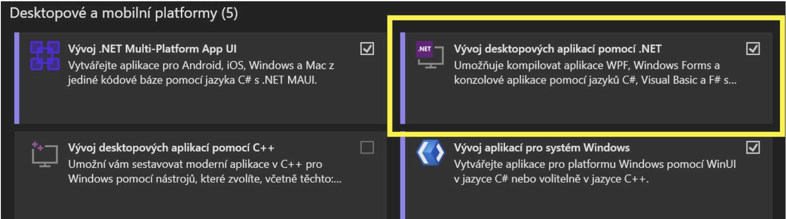
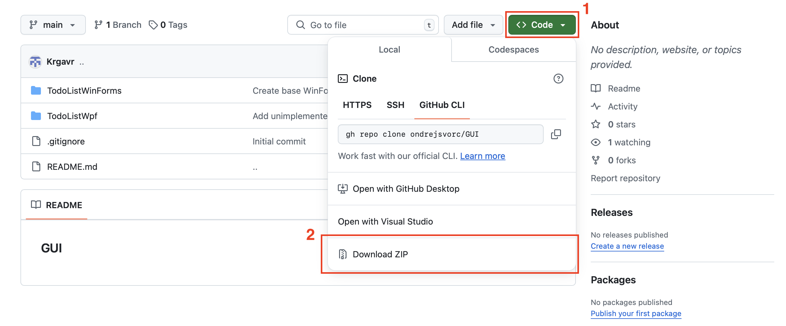
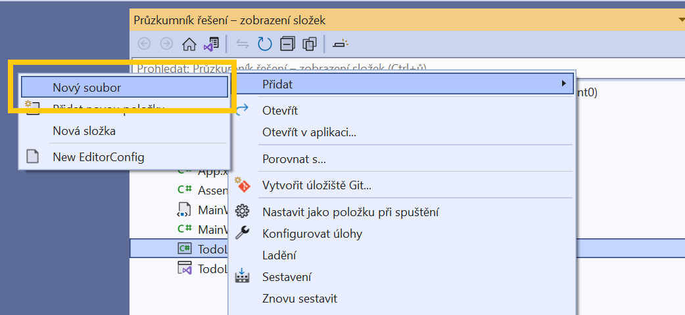

### GUI

# WPF + WinForms TODO List

Tento projekt představuje TODO List, vyvinutý pomocí WPF a WinForms.
Budeme demonstrovat proces tvorby této aplikace krok za krokem.


## Požadavky před zahájením práce

Než začnete s vývojem, ujistěte se, že máte nainstalovány následující nástroje:

1. **Visual Studio**

Pokud jej nemáte, stáhněte si ho z oficiálních stránek: https://visualstudio.microsoft.com/cs/downloads/

Při instalaci vyberte "Vývoj desktopových aplikací pomocí .NET".



2. **.NET 8**

Podpora nejnovější verze .NET je vyžadována pro běh projektu.


## Stažení projektu

Celý náš hotový projekt si můžete stáhnout z GitHubu:

1. Otevřete repozitář.
2. Klikněte na Code → Download ZIP.



3. Rozbalte soubor a otevřete projekt ve Visual Studiu.


## Funkce

### Přidávání úkolů
### Nastavení typu úkolu (pracovní, univerzitní, osobní, jiný)
### Nastavení stavu úkolu (dokončený/nedokončený)
### Odebírání úkolů
### Úprava úkolů
### ukládání úkolů do souboru (JSON)
### Načítání úkolů ze souboru (JSON)

# Tvorba DoToList ve WPF
## Návrh rozhraní v XAML
Dbejte na odsazení. "<" - začátek tagu, "/>" anebo "</"- ukončení tagu
### Window
Tvoří základní prostor, na který budeme postupně přídavat naše další prvky (vnořovat). Jde o základ, bez kterého by se desktopová aplikace nezobrazila. "x:Class" zde se nachazi  odkaz na třídu, se kterou je XAML soubor spojený, v našem případe jde o třídu MainWindow ve jmenném prostoru TodoListWpf. "xmlns, xmlns: x"– inforamce o xaml schéma. URL odkazy poskytují zdroj definic tagů. Bez nich náš program XAML tagy nerozezná. URL odkazy se mohou měnit v případě užití jiných knihoven. "Title" – nadpis aplikace. "Height, Width" – šířka a výška okna. "Background" - Barva základního okna v hexadecimálním zápisu. "FontFamily" - font písma na základním okně a všech jeho prvcích. "FontSize" - velikost písma/fontu. "ForeGround" - barva textu písma v hexadecimáním zápisu. "HorizontalAlignment" - zarovnání okna aplikace na uživatelské obrazovce.
```
<Window 
    x:Class="TodoListWpf.MainWindow"
    xmlns="http://schemas.microsoft.com/winfx/2006/xaml/presentation"
    xmlns:x="http://schemas.microsoft.com/winfx/2006/xaml"
    Title="TODO List"
    Height="600"
    Width="700"
    Background="#1E1E1E"
    FontFamily="Segoe UI"
    FontSize="14"
    Foreground="#CCCCCC"
    HorizontalAlignment="Center"
    VerticalAlignment="Center">
```
### Grid
Grid je neviditelná mřížka, která zabírá celý prostor okna a pomáhá nam pozicovat prvky. "Grid Margin" - odsazení mřížky, a tudíž i prvků, od okrajů okna. "Grid.RowDefinitions" - párovy tag, slouží k přímému pozicování prvků. Jelikož naše okno chceme rozdělit na tři horizontální části, tak potřebujeme nadefinovat tři řádky, ve kterých budou naše prvky. 1. RowDefinition - "Height" = *, znamená, že chceme aby výška řádku zabírala 1/n prostoru okna, kde n = počet řádku, v našem případě jedna třetina prostoru. 2. a 3. řádek, "Height" = Auto - výška řádku se automaticky přizpůsobí podle obsahu. 
```    
    <Grid Margin="10">
        <Grid.RowDefinitions>
            <RowDefinition 
                Height="*"/>
            <RowDefinition 
                Height="Auto"/>
            <RowDefinition 
                Height="Auto"/>
        </Grid.RowDefinitions>
```
### DataGrid
Tabulka. My v ní budeme vypisovat seznam úkolů. "x:Name" - Vlastnost elementu, název konkrétního prvku. Tím, že tag pojmenuju, tak k němu pomocí tohoto jména můžu později přistupovat z logické části programu MainWindow jako k C# objektu. "Grid.row" – Určení řádku z předešlého bloku kódu, ve kterém se bude vyskytovat (indexování jde od 0). "AutogenerateColumns" - Nastavení, zda chceme vygenerovat sloupce automaticky podle obsahu z námi dodané kolekce. V našem případě je uživateli potřeba vypsat pouze některé vlasnosti objektu třídy TaskItem, kterou zde vytvoříme později, proto je nastavení na False. "CanUserAddRows" -  Možnost uživatele přímo přidat záznamy do tabulky. V našem případě bude toto přidávání provedeno pomocí jiných metod, proto nastavení False. "IsReadOnly" - Zda uživatel ne/může přímo vpisovat do tabulky. V našem kódu je tato úprava také provedena jinými metodami, proto True. "BorderBrush" - Barva ohraničení tabulky. "BorderThickness" - Šířka ohraničení tabulky. "SelectionChanged" - Je potřeba nastavit metodu, která bude obsluhovat případ, kdy uživatel klikne na jeden z řádků. Pokud není vybrán řádek, hodnota je null. Tuto metodu budemem programovat později.


```
        <DataGrid 
            x:Name="dataGridTasks"
            Grid.Row="0"
            AutoGenerateColumns="False"
            CanUserAddRows="False"
            IsReadOnly="True"
            Background="#2D2D30"
            Foreground="#CCCCCC"
            BorderBrush="#3E3E42"
            BorderThickness="1"
            SelectionChanged="DataGridTasks_SelectionChanged">
```
DataGrid.Resources - Odkud má datagrid čerpat definice stylu. "Style" - Tag pro definici stylu.. 'příkaz styluj'. "TargetType" - Co se bude stylovat. "Setter Property, Value" - Co se má nastavit a na co se má to má nastavit. "Style.Triggers" - Spouštěč stylu. Mezi tagy můžeme definovat jednotlivé spoušteče. Například
pokud vlastnost IsSelected na buňce datagridu má hodnotu true (je označena) tak se právě díky spouštěči nastaví barva ohraničení na žlutou.

```
             <DataGrid.Resources>
                <Style TargetType="DataGridColumnHeader">
                    <Setter Property="Background" Value="#3E3E42"/>
                    <Setter Property="Foreground" Value="#CCCCCC"/>
                    <Setter Property="BorderBrush" Value="#565656"/>
                </Style>
                <Style TargetType="DataGridCell">
                    <Setter Property="Background" Value="#2D2D30"/>
                    <Setter Property="Foreground" Value="#CCCCCC"/>
                    <Setter Property="BorderBrush" Value="#565656"/>
                    <Style.Triggers>
                        <Trigger Property="IsSelected" Value="True">
                            <Setter Property="BorderBrush" Value="Yellow"/>
                        </Trigger>
                    </Style.Triggers>
                </Style>
                <Style TargetType="DataGridRow">
                    <Setter Property="Background" Value="#2D2D30"/>
                    <Setter Property="Foreground" Value="#CCCCCC"/>
                    <Setter Property="BorderBrush" Value="#565656"/>
                </Style>
              </DataGrid.Resources>
```
DataGrid.Columns - definice sloupců tabulky. "DataGridTextColumn – Definice, že jde sloupec v němž bude text. DataGridCheckBoxColumn – Definice, že jde o sloupec v němž budou zaškrtávací políčka. "Binding" – Zda je tabulka vázana kolekci objektů. V našem případě máme na datagrid navázaný seznam ukolů, což je seznam objektů třídy TaskItem. Každý TaskItem má atributy: Title(string), Type(string), Done(CheckBox, resp. boolean + null), datagrid pomocí binding o seznamu objektů TaskItem ví a automicky je rozřadí právě podle ?header== atribut.
```
              <DataGrid.Columns>
                <!-- Sloupec pro název úkolu -->
                <DataGridTextColumn 
                    Header="Title" 
                    Binding="{Binding Title}"
                    Width="*"/>

                <!-- Sloupec pro typ úkolu -->
                <DataGridTextColumn 
                    Header="Type" 
                    Binding="{Binding Type}"
                    Width="150"/>

                <!-- Sloupec pro stav úkolu -->
                <DataGridCheckBoxColumn 
                    Header="Done" 
                    Binding="{Binding IsDone}"
                    Width="100"/>
                </DataGrid.Columns>
        </DataGrid>

```
### StackPanel
Podobně jako grid slouží k pozicování. Je jednodimenzionální, řadí prvky buď pod sebe (vertical) nebo nad sebe (horizontal) – "orientantion". "Margin" – Odsazení (v tomto pořadí) zleva, shora, zprava, zdola. "TextBox" - Textové pole, textový vstup pro uživatele. "ToolTip" - nápověda užvateli, co s textovým polem má dělat. Nápověda se zobrazí při držení focus (uživate najede myší na textové pole a chvíli ji tam podrží. Nemusí na textové pole klikat). "ComboBox" - Seznam možných výběrů. "ComboBoxItem" - Prvky comboboxu lze nadefinat přímo v XAMLu. My tuhle možnost nevyužijeme, protože naše položky se načtou pomocí výčtového typu TaskType, který je zdrojem těchto dat (naprogramujeme později). "CheckBox" - zaškrtávací políčko.

```
        <StackPanel 
            Grid.Row="1"
            Orientation="Vertical"
            Margin="0,10,0,0">

            <!-- Panel se vstupními prvky -->
            <StackPanel 
                Orientation="Horizontal"
                HorizontalAlignment="Center"
                Margin="0,0,0,5">

                <!-- TextBox pro název úkolu -->
                <TextBox 
                    x:Name="textBoxTask"
                    Width="200"
                    Height="25"
                    Margin="5"
                    ToolTip="Enter a new or updated task"
                    Background="#2D2D30"
                    Foreground="#CCCCCC"
                    BorderBrush="#3E3E42"
                    BorderThickness="1"/>

                <!-- ComboBox pro výběr typu úkolu -->
                <ComboBox 
                    x:Name="comboBoxTaskType"
                    Width="150"
                    Height="25"
                    Margin="5"
                    Background="#CCCCCC"
                    Foreground="#2D2D30"
                    BorderBrush="#3E3E42"
                    BorderThickness="1"
                    ToolTip="Select task type">
                </ComboBox>

                <!-- CheckBox pro nastavení stavu úkolu -->
                <CheckBox 
                    x:Name="checkBoxIsDone"
                    Content="Done"
                    VerticalAlignment="Center"
                    Margin="5"
                    Foreground="#CCCCCC"/>
            </StackPanel>

```
"Button" - Tlačítko pro uživatele. "Content" - Co bude na tlačtku napsáno. "Click" - Jaký event vyvolá zmáčknutí tlačítka. "Cursor" - Na jakou ikonu se změní ukazatel myši po najetí na tlačítko.

```
 <!-- Panel pro tlačítka (přidat/aktualizovat/smazat úkol) -->
            <StackPanel 
                Orientation="Horizontal"
                HorizontalAlignment="Center">

                <Button 
                    Content="Add New Task"
                    Click="AddTask_Click"
                    Height="50"
                    Width="150"
                    Margin="10,0"
                    FontSize="16"
                    FontWeight="SemiBold"
                    Background="#3E3E42"
                    Foreground="#CCCCCC"
                    BorderBrush="#565656"
                    Cursor="Hand"/>

                <Button 
                    Content="Update Task"
                    Click="UpdateTask_Click"
                    Height="50"
                    Width="150"
                    Margin="10,0"
                    FontSize="16"
                    FontWeight="SemiBold"
                    Background="#3E3E42"
                    Foreground="#CCCCCC"
                    BorderBrush="#565656"
                    Cursor="Hand"/>

                <Button 
                    Content="Delete Task"
                    Click="DeleteTask_Click"
                    Height="50"
                    Width="150"
                    Margin="10,0"
                    FontSize="16"
                    FontWeight="SemiBold"
                    Background="#3E3E42"
                    Foreground="#CCCCCC"
                    BorderBrush="#565656"
                    Cursor="Hand"/>
            </StackPanel>
        </StackPanel>

        <!-- Panel pro operace se soubory -->
        <StackPanel 
            Grid.Row="2"
            Orientation="Horizontal"
            HorizontalAlignment="Center"
            Margin="0,10,0,0">

            <Button 
                Content="Save to File"
                Click="SaveTasks_Click"
                Height="50"
                Width="150"
                Margin="10,0"
                FontSize="16"
                FontWeight="SemiBold"
                Background="#3E3E42"
                Foreground="#CCCCCC"
                BorderBrush="#565656"
                Cursor="Hand"/>

            <Button 
                Content="Load from File"
                Click="LoadTasks_Click"
                Height="50"
                Width="150"
                Margin="10,0"
                FontSize="16"
                FontWeight="SemiBold"
                Background="#3E3E42"
                Foreground="#CCCCCC"
                BorderBrush="#565656"
                Cursor="Hand"/>
        </StackPanel>
    </Grid>
</Window>
```
## Tvorba logiky programu
### Vytvoření record TaskItem a enum TaskType
V našem řešení (solution) si vytvoříme nový soubor se jménem TaskItem. To uděláme kliknutím pravého tlačítks myši na libovolný prostor prostor v panelu Průzkumník řšení - zobrazení složek (jenom ne na složku obj nebo bin moc prosím..třeba kliknout pravým na ToDoListWpf.csproj je fajn alternativou) a vybereme možnost Přidat -> Nový Soubor. Nový soubor přejmenujeme na TaskItem.cs .

Nyní můžeme naprogramovat chovaní těchto dvou typů. Nebudeme je zbytečně programovat jako třídy, protože vzhledem k jejich využití v logice programu to není potřeba, nebo by to dokonce mohlo být na škodu. Potřebujeme nadefinovat ve kterém jmenném prostoru se pohybujeme (namespace ToDoListWpf) . Vytvoříme typ record TaskItem s potřebnými vlastnostmi Id třídy Guid (Global unique identifier), Title neboli co je úkolem v ToDo Listu, Type typu TaskType (typ enum TaskType naprogramujeme níže), který představuje čeho se náš úkol týká a IsDone, který nám defaultně říká, že úkol ještě hotový není. "Record" může být v C# považován za třídu, ale jde spíše o strukturovaný typ určený primárně pro ukládání neměnných dat ( https://learn.microsoft.com/en-us/dotnet/csharp/fundamentals/types/records ). Poté si vytvoříme potřebný typ enum TaskType, který má přirazené pojmenované položky k celým číslům. "Enum"  je hoodnotový výčtový typ. Tento výčtový typ používáme k reprezentaci volby z množiny vzájemně se vylučujících hodnot nebo jako kombinaci voleb. Hodnoty jsou defaultně přirazovány k intigerům začínaje 0, avšak toto nastavení jde změnit. ( https://learn.microsoft.com/en-us/dotnet/csharp/language-reference/builtin-types/enum )
```
namespace TodoListWpf;

/// <summary>
/// Reprezentuje úkol.
/// </summary>
/// <param name="Id">Identifikátor úkolu.</param>
/// <param name="Title">Název úkolu.</param>
/// <param name="Type">Typ úkolu.</param>
/// <param name="IsDone">Stav úkolu.</param>
public record TaskItem(Guid Id, string Title, TaskType Type = TaskType.Other, bool IsDone = false);

/// <summary>
/// Reprezentuje typ úkolu.
/// </summary>
public enum TaskType { Work = 0, University = 1, Personal = 2, Other = 3 }
```
Nyní vytvoříme nový soubor se jménem TaskService.cs, který bude obsahovat interface ITaskService, třídu TaskService : ITaskService a record OperationResult. ITaskService není přímo nutný interface, ale pomůže nám v ujasnění logiky a metod potřebných k fungovaní aplikace. Metody ITaskService nám vrací hodnoty typu OperationResult, kvůli ověřovaní zda operace proběhly úspěšně nebo ne. Typ OperationResult naprogramujeme níže.

```
using System.Collections.ObjectModel;

namespace TodoListWpf;

public interface ITaskService
{
    /// <summary>
    /// Kolekce úkolů.
    /// </summary>
    public ObservableCollection<TaskItem> Tasks { get; }

    /// <summary>
    /// Přidá nový úkol.
    /// </summary>
    public OperationResult AddTask(string title, TaskType type, bool isDone);

    /// <summary>
    /// Aktualizuje zadaný úkol.
    /// </summary>
    public OperationResult UpdateTask(TaskItem task, string title, TaskType type, bool isDone);

    /// <summary>
    /// Odstraní zadaný úkol.
    /// </summary>
    public OperationResult DeleteTask(TaskItem task);

    /// <summary>
    /// Uloží úkoly do souboru.
    /// </summary>
    public OperationResult SaveTasks();

    /// <summary>
    /// Načte úkoly ze souboru.
    /// </summary>
    public OperationResult LoadTasks();
}
```
Před implementací ITaskService si vytvoříme record typ OperationResult. Tento typ nám pomocí metod Success a Failure vrací boolean hodnotu + ErrorMessage, která může být null anebo string. Metody se volají na základě If statementů níže v kódu. Obsah ErrorMessage se definuje pro jednotlivé případy také na základě If statementů.
```
/// <summary>
/// Reprezentuje výsledek operace, např. při přidávání, aktualizaci či mazání úkolu.
/// Obsahuje informaci o tom, zda operace proběhla úspěšně, a případnou chybovou zprávu, pokud došlo k selhání.
/// </summary>
/// <param name="IsSuccess">Indikuje, zda operace byla úspěšná.</param>
/// <param name="ErrorMessage">Chybová zpráva, pokud operace selhala; jinak null.</param>
public record OperationResult(bool IsSuccess, string? ErrorMessage)
{
    /// <summary>
    /// Vytvoří a vrátí úspěšný výsledek operace.
    /// </summary>
    public static OperationResult Success() => new(true, null);

    /// <summary>
    /// Vytvoří a vrátí neúspěšný výsledek operace s uvedenou chybovou zprávou.
    /// </summary>
    /// <param name="errorMessage">Text chybové zprávy popisující důvod neúspěchu operace.</param>
    public static OperationResult Failure(string errorMessage) => new(false, errorMessage);
}
```
Předpřipravíme si implementaci ITaskService ve formě třídy TaskService. Jelikož naše aplikace bude umět zapisovat/načítat úkoly do/ze souboru, je potřeba ho vytvořit, pojmenovat, a definat k němu cestu. Samotná třída TaskService si bude sama držet kolekci úkolů pro jejich přímou manipulaci v aplikaci.

```
/// <summary>
/// Služba pro správu úkolů.
/// </summary>
public class TaskService(string path = "tasks.json") : ITaskService
{
    /// <inheritdoc/>
    public ObservableCollection<TaskItem> Tasks { get; } = [];

    /// <inheritdoc/>
    public OperationResult AddTask(string title, TaskType type, bool isDone)
    {
       throw new NotImplementedException();
    }

    /// <inheritdoc/>
    public OperationResult UpdateTask(TaskItem task, string title, TaskType type, bool isDone)
    {
        throw new NotImplementedException();
    }

    /// <inheritdoc/>
    public OperationResult DeleteTask(TaskItem task)
    {
        throw new NotImplementedException();
    }

    /// <inheritdoc/>
    public OperationResult SaveTasks()
    {
        throw new NotImplementedException();
    }

    /// <inheritdoc/>
    public OperationResult LoadTasks()
    {
        throw new NotImplementedException();
    }
}
```
Otevřeme si soubor MainWindow.xaml.cs kde zinicializuje uživatelské okno nadefinované v souboru MainWindow.xaml. Zde budou také naprogramovaní event handlers (viz prezentace). Event handlers budou propojeni s metodami v třídě TaskService. Při vytváření třídy MainWindow je potřeba vytvořit privátní objekt _taskService jakožto objekt třídy TaskService. Jeho vytvoření je nutné pro správu úkolů na popředí i pozadí aplikace, avšak nemusí byt přístupný pro třídy mimo MainWindow. Poté je nutno nastavit datové zdroje pro datagrid (kolekce kterou si náš objekt _taskService drží) a pro combobox ( TaskTypes z výše definovaného typu). Poslední krok při inicializici okna je nastavení defaultní hodnoty comboboxu na Other (TaskType). Kromě funkcí, které má _taskService definované (a zároveň které máme definované jako UI v XAML souboru) musíme naprogramovat i funkci DataGridTasks_SelectionChanged(), kterou jsme při tvorbě XAML kódu nastavili jako event handlera v případě, že uživatel klikne na jeden z řádku na datagridu.
```
using System.Windows;
using System.Windows.Controls;

namespace TodoListWpf;

/// <summary>
/// Interakční logika pro MainWindow.xaml.
/// </summary>
public partial class MainWindow : Window
{
    private readonly ITaskService _taskService = new TaskService();

    public MainWindow()
    {
        InitializeComponent();

        // Nastavení datových zdrojů.
        dataGridTasks.ItemsSource = _taskService.Tasks;
        comboBoxTaskType.ItemsSource = Enum.GetValues(typeof(TaskType));

        // Nastavení výchozí hodnoty pro ComboBox.
        comboBoxTaskType.SelectedItem = TaskType.Other;
    }

    /// <summary>
    /// Přidá nový úkol, pokud má vyplněný název.
    /// </summary>
    private void AddTask_Click(object sender, RoutedEventArgs e)
    {
        
    }

    /// <summary>
    /// Aktualizuje vybraný úkol s novým textem z textového pole.
    /// </summary>
    private void UpdateTask_Click(object sender, RoutedEventArgs e)
    {
        
    }

    /// <summary>
    /// Odstraní vybraný úkol.
    /// </summary>
    private void DeleteTask_Click(object sender, RoutedEventArgs e)
    {

    }

    /// <summary>
    /// Zobrazí vybraný úkol ve vstupních prvcích při změně výběru v DataGridu.
    /// </summary>
    private void DataGridTasks_SelectionChanged(object sender, SelectionChangedEventArgs e)
    {
        
    }

    /// <summary>
    /// Uloží úkoly do souboru.
    /// </summary>
    private void SaveTasks_Click(object sender, RoutedEventArgs e)
    {

    }

    /// <summary>
    /// Načte úkoly ze souboru.
    /// </summary>
    private void LoadTasks_Click(object sender, RoutedEventArgs e)
    {

    }
}
```


