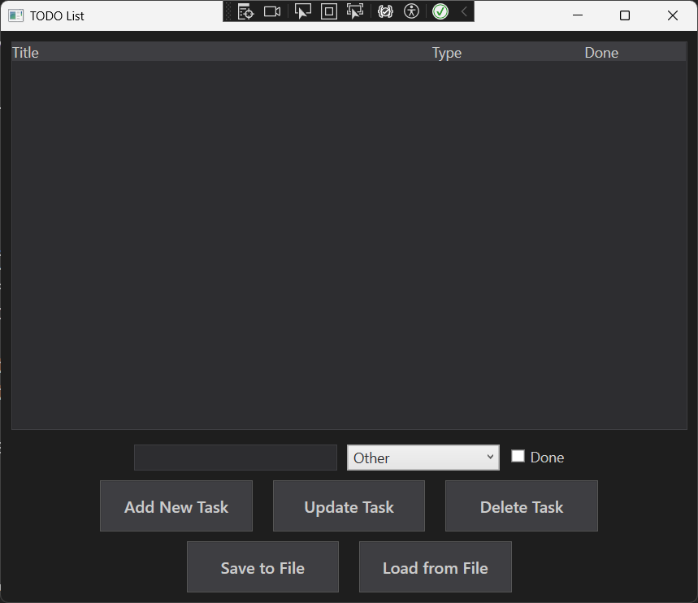
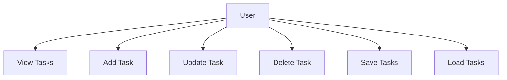
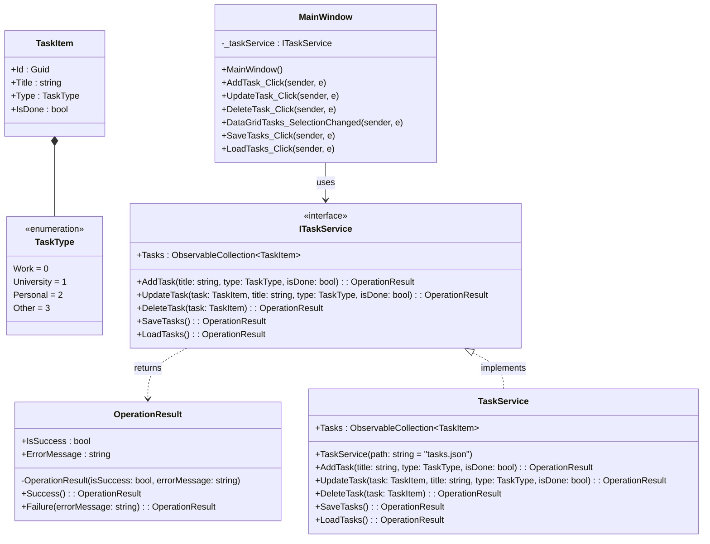
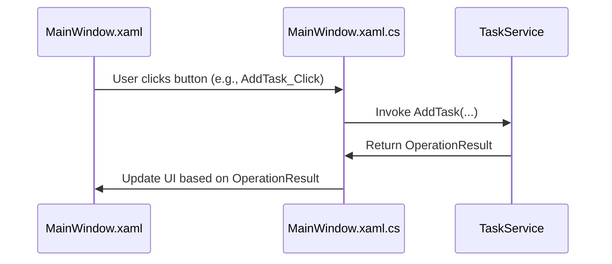
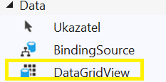
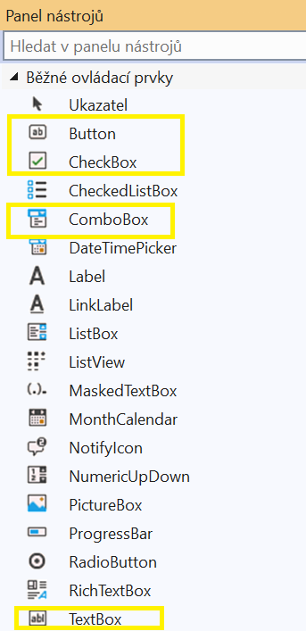
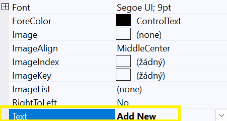

# WPF + WinForms TODO List



Tento projekt představuje TODO List, vyvinutý pomocí WPF a WinForms.
Budeme demonstrovat proces tvorby této aplikace krok za krokem.

## Požadavky před zahájením práce
Než začnete s vývojem, ujistěte se, že máte nainstalovány následující nástroje:

1. **Visual Studio 2022** (pokud jej nemáte, stáhněte si ho z oficiálních stránek: https://visualstudio.microsoft.com/cs/downloads/).
2. **.NET 8** (podpora nejnovější verze .NET je vyžadována pro běh projektu).

Při instalaci vyberte **Vývoj desktopových aplikací pomocí .NET**.


## Stažení projektu
Celý náš hotový projekt si můžete stáhnout z GitHubu:

1. Otevřete repozitář.
2. Klikněte na Code → Download ZIP.
3. Rozbalte soubor a otevřete projekt ve Visual Studiu.


## Funkční požadavky
- Zobrazování úkolů.
- Přidávání úkolů.
- Nastavení typu úkolu (pracovní, univerzitní, osobní, jiný).
- Nastavení stavu úkolu (dokončený/nedokončený).
- Odebírání úkolů.
- Úprava úkolů.
- Ukládání úkolů do souboru (JSON).
- Načítání úkolů ze souboru (JSON).



# Tvorba TODO List ve WPF

## Návrh rozhraní v XAML
Dbejte na odsazení. "<" - začátek tagu, "/>" anebo "</"- ukončení tagu

### Window
Tvoří základní prostor, na který budeme postupně přídavat naše další prvky (vnořovat). Jde o základ, bez kterého by se desktopová aplikace nezobrazila. Kód se nachází v souboru `MainWindow.xaml`
- **`x:Class`** zde se nachazi  odkaz na třídu, se kterou je XAML soubor spojený, v našem případe jde o třídu MainWindow ve jmenném prostoru TodoListWpf.
- **`xmlns, xmlns: x`**– informace o XAML schéma. URL odkazy poskytují zdroj definic tagů. Bez nich náš program XAML tagy nerozezná. URL odkazy se mohou měnit v případě užití jiných knihoven.
- **`Title`** – nadpis aplikace. "Height, Width" – šířka a výška okna. "Background" - Barva základního okna v hexadecimálním zápisu.
- **`FontFamily`** - font písma na základním okně a všech jeho prvcích.
- **`FontSize`** - velikost písma/fontu.
- **`Foreground`** - barva textu písma v hexadecimáním zápisu. "HorizontalAlignment" - zarovnání okna aplikace na uživatelské obrazovce.
```xaml
<Window
    x:Class="TodoListWpf.MainWindow"
    xmlns="http://schemas.microsoft.com/winfx/2006/xaml/presentation"
    xmlns:x="http://schemas.microsoft.com/winfx/2006/xaml"
    Title="TODO List"
    Height="600"
    Width="700"
    Background="#1E1E1E"
    FontFamily="Segoe UI"
    FontSize="14"
    Foreground="#CCCCCC"
    HorizontalAlignment="Center"
    VerticalAlignment="Center">
    <!--Zde vložte další kód-->
</Window>
```

### Grid
Grid je neviditelná mřížka, která zabírá celý prostor okna a pomáhá nam pozicovat prvky.
- **`Grid Margin`** - odsazení mřížky, a tudíž i prvků, od okrajů okna.
- **`Grid.RowDefinitions`** - párový tag, slouží k přímému pozicování prvků.
Jelikož naše okno chceme rozdělit na tři horizontální části, tak potřebujeme nadefinovat tři řádky, ve kterých budou naše prvky. Toho dosáhneme pomocí **`RowDefinition`**
      - **1.`RowDefinition`** - `Height="*"`, znamená, že chceme aby výška řádku zabírala 1/n prostoru okna, kde n = počet řádku, v našem případě jedna třetina prostoru.
      - **2. a 3.`RowDefinition`** - `Height = "Auto" `- výška řádku se automaticky přizpůsobí podle obsahu.
```xaml
<Grid Margin="10">
    <Grid.RowDefinitions>
        <RowDefinition
            Height="*"/>
        <RowDefinition
            Height="Auto"/>
        <RowDefinition
            Height="Auto"/>
    </Grid.RowDefinitions>
    <!--Zde vložte další kód-->
</Grid>
```

### DataGrid
Tabulka ve které vypíšeme seznam úkolů.
- **`x:Name`** - Vlastnost elementu, název konkrétního prvku. Tím, že tag pojmenuju, tak k němu pomocí tohoto jména můžu později přistupovat z logické části programu MainWindow jako k C# objektu.
- **`Grid.row`** – Určení řádku z předešlého bloku kódu, ve kterém se bude vyskytovat (indexování jde od 0).
- **`AutogenerateColumns`** - Nastavení, zda chceme vygenerovat sloupce automaticky podle obsahu z námi dodané kolekce. V našem případě je uživateli potřeba vypsat pouze některé vlasnosti objektu třídy TaskItem, kterou zde vytvoříme později, proto je nastavení na False.
- **`CanUserAddRows`** -  Možnost uživatele přímo přidat záznamy do tabulky. V našem případě bude toto přidávání provedeno pomocí jiných metod, proto nastavení False.
- **`IsReadOnly`**- Zda uživatel ne/může přímo vpisovat do tabulky. V našem kódu je tato úprava také provedena jinými metodami, proto True.
- **`BorderBrush`** - Barva ohraničení tabulky.
- **`BorderThickness`** - Šířka ohraničení tabulky.
- **`SelectionChanged`** - Je potřeba nastavit metodu, která bude obsluhovat případ, kdy uživatel klikne na jeden z řádků. Pokud není vybrán řádek, hodnota je null. Tuto metodu budemem programovat později.
```xaml
<DataGrid
    x:Name="dataGridTasks"
    Grid.Row="0"
    AutoGenerateColumns="False"
    CanUserAddRows="False"
    IsReadOnly="True"
    Background="#2D2D30"
    Foreground="#CCCCCC"
    BorderBrush="#3E3E42"
    BorderThickness="1"
    SelectionChanged="DataGridTasks_SelectionChanged">
    <!--Zde vložte další kód-->
</DataGrid>
```
**DataGrid.Resources** Určuje odkud má DataGrid čerpat definice stylu.
- **`Style`** - Tag pro definici stylu.. 'příkaz styluj'.
- **`TargetType`** - Co se bude stylovat.
- **`Setter Property, Value`** - Co se má nastavit a na co se má to má nastavit.
- **`Style.Triggers`** - Spouštěč stylu. Mezi tagy můžeme definovat jednotlivé spoušteče. Například
pokud vlastnost `IsSelected` na buňce DataGridu má hodnotu `true` (je označena) tak se právě díky spouštěči nastaví barva ohraničení na žlutou.

```xaml
<DataGrid.Resources>
    <Style TargetType="DataGridColumnHeader">
        <Setter Property="Background" Value="#3E3E42"/>
        <Setter Property="Foreground" Value="#CCCCCC"/>
        <Setter Property="BorderBrush" Value="#565656"/>
    </Style>
    <Style TargetType="DataGridCell">
        <Setter Property="Background" Value="#2D2D30"/>
        <Setter Property="Foreground" Value="#CCCCCC"/>
        <Setter Property="BorderBrush" Value="#565656"/>
    <Style.Triggers>
        <Trigger Property="IsSelected" Value="True">
            <Setter Property="BorderBrush" Value="Yellow"/>
        </Trigger>
    </Style.Triggers>
    </Style>
    <Style TargetType="DataGridRow">
        <Setter Property="Background" Value="#2D2D30"/>
        <Setter Property="Foreground" Value="#CCCCCC"/>
        <Setter Property="BorderBrush" Value="#565656"/>
    </Style>
</DataGrid.Resources>
<!--Zde vložte další kód-->
```

**DataGrid.Columns** definuje sloupce tabulky.
- **`DataGridTextColumn`** – Definice, že jde sloupec v němž bude text.
- **`DataGridCheckBoxColumn`** – Definice, že jde o sloupec v němž budou zaškrtávací políčka.
- **`Binding`** – Zda je tabulka vázana kolekci objektů.
 V našem případě máme na DataGrid navázaný seznam ukolů, což je seznam objektů třídy `TaskItem`. Každý `TaskItem` má atributy:
- `Title(string)`
- `Type(string)`
- `Done(CheckBox, resp. boolean + null)`
  DataGrid pomocí **binding** o seznamu objektů `TaskItem` ví a automicky je rozřadí právě podle **?header== atribut**.
```xaml
<DataGrid.Columns>
    <!-- Sloupec pro název úkolu -->
    <DataGridTextColumn
        Header="Title"
        Binding="{Binding Title}"
        Width="*"/>

    <!-- Sloupec pro typ úkolu -->
    <DataGridTextColumn
        Header="Type"
        Binding="{Binding Type}"
        Width="150"/>

    <!-- Sloupec pro stav úkolu -->
    <DataGridCheckBoxColumn
        Header="Done"
        Binding="{Binding IsDone}"
        Width="100"/>
</DataGrid.Columns>
```

### StackPanel
Podobně jako **Grid** slouží k pozicování. Je jednodimenzionální, řadí prvky buď pod sebe (**vertical**) nebo nad sebe (**horizontal**)– **`orientantion`**.
- **`Margin`** – Odsazení (v tomto pořadí) **zleva, shora, zprava, zdola**.
- **`TextBox`** - Textové pole, textový vstup pro uživatele.
- **`ToolTip`** - nápověda užvateli, co s textovým polem má dělat.
    - Nápověda se zobrazí při **držení focus** (uživate najede myší na textové pole a chvíli ji tam podrží. Nemusí na textové pole klikat).
- **`ComboBox`** - Seznam možných výběrů.
- **`ComboBoxItem`** - Prvky comboboxu lze nadefinat přímo v XAMLu.
    -  My tuhle možnost nevyužijeme, protože naše položky se načtou pomocí výčtového typu `TaskType`, který je zdrojem těchto dat (naprogramujeme později).
- **`CheckBox`** - zaškrtávací políčko.
```xaml
<!--Tento kód vložte za </DataGrid> -->
<StackPanel
    Grid.Row="1"
    Orientation="Vertical"
    Margin="0,10,0,0">

    <!-- Panel se vstupními prvky -->
    <StackPanel
        Orientation="Horizontal"
        HorizontalAlignment="Center"
        Margin="0,0,0,5">

        <!-- TextBox pro název úkolu -->
        <TextBox
            x:Name="textBoxTask"
            Width="200"
            Height="25"
            Margin="5"
            ToolTip="Enter a new or updated task"
            Background="#2D2D30"
            Foreground="#CCCCCC"
            BorderBrush="#3E3E42"
            BorderThickness="1"/>

        <!-- ComboBox pro výběr typu úkolu -->
        <ComboBox
            x:Name="comboBoxTaskType"
            Width="150"
            Height="25"
            Margin="5"
            Background="#CCCCCC"
            Foreground="#2D2D30"
            BorderBrush="#3E3E42"
            BorderThickness="1"
            ToolTip="Select task type">
        </ComboBox>

        <!-- CheckBox pro nastavení stavu úkolu -->
        <CheckBox
            x:Name="checkBoxIsDone"
            Content="Done"
            VerticalAlignment="Center"
            Margin="5"
            Foreground="#CCCCCC"/>
    </StackPanel>
    <!--Zde vložte další kód-->
</StackPanel>
```

**Button** - Tlačítko pro uživatele.
- **`Content`** - Co bude na tlačtku napsáno.
- **`Click`** - Jaký event vyvolá zmáčknutí tlačítka.
- **`Cursor`** - Na jakou ikonu se změní ukazatel myši po najetí na tlačítko.
```xaml
<!-- Panel pro tlačítka (přidat/aktualizovat/smazat úkol) -->
<StackPanel
    Orientation="Horizontal"
    HorizontalAlignment="Center">

    <Button
        Content="Add New Task"
        Click="AddTask_Click"
        Height="50"
        Width="150"
        Margin="10,0"
        FontSize="16"
        FontWeight="SemiBold"
        Background="#3E3E42"
        Foreground="#CCCCCC"
        BorderBrush="#565656"
        Cursor="Hand" />

    <Button
        Content="Update Task"
        Click="UpdateTask_Click"
        Height="50"
        Width="150"
        Margin="10,0"
        FontSize="16"
        FontWeight="SemiBold"
        Background="#3E3E42"
        Foreground="#CCCCCC"
        BorderBrush="#565656"
        Cursor="Hand" />

    <Button
        Content="Delete Task"
        Click="DeleteTask_Click"
        Height="50"
        Width="150"
        Margin="10,0"
        FontSize="16"
        FontWeight="SemiBold"
        Background="#3E3E42"
        Foreground="#CCCCCC"
        BorderBrush="#565656"
        Cursor="Hand" />
</StackPanel>

<!-- Panel pro operace se soubory -->
<StackPanel
    Grid.Row="2"
    Orientation="Horizontal"
    HorizontalAlignment="Center"
    Margin="0,10,0,0">

    <Button
        Content="Save to File"
        Click="SaveTasks_Click"
        Height="50"
        Width="150"
        Margin="10,0"
        FontSize="16"
        FontWeight="SemiBold"
        Background="#3E3E42"
        Foreground="#CCCCCC"
        BorderBrush="#565656"
        Cursor="Hand" />

    <Button
        Content="Load from File"
        Click="LoadTasks_Click"
        Height="50"
        Width="150"
        Margin="10,0"
        FontSize="16"
        FontWeight="SemiBold"
        Background="#3E3E42"
        Foreground="#CCCCCC"
        BorderBrush="#565656"
        Cursor="Hand" />
</StackPanel>
```

## Tvorba logiky programu

### Architektura


### Průběh událostí


### Vytvoření typů record `TaskItem` a enum `TaskType`
V našem řešení (solution) si vytvoříme nový soubor se jménem `TaskItem.cs`.
Tak učiníme v tomto pořadí:
1. Kliknutím pravého tlačítka myši na libovolný prostor v panelu **Průzkumník řešení - zobrazení složek**.
   - **Neklikat** pravým na složku `obj` nebo `bin`.
   - kliknout pravým na **`ToDoListWpf.csproj`** je fajn alternativou.
2. Vybereme možnost **Přidat -> Nový Soubor**.
3. Nový soubor přejmenujeme na **`TaskItem.cs`** .

Nyní můžeme naprogramovat chovaní těchto dvou typů. Nebudeme je zbytečně programovat jako **třídy**, protože vzhledem k jejich využití v logice programu to není potřeba, nebo by to dokonce mohlo být na škodu.
Potřebujeme nadefinovat ve kterém jmenném prostoru se pohybujeme
```
namespace ToDoListWpf;
```
### Definování `record TaskItem`:
Vytvoříme typ `public record TaskItem` s potřebnými vlastnostmi
- `Id(Guid)` - identifikator/Global unique identifier
- `Title(string)` - co je úkolem v ToDo Listu
- `Type(TaskType)` - představuje čeho se náš úkol týká (typ `enum TaskType` naprogramujeme níže)
- `IsDone(Boolean)` - defaultně říká, že úkol ještě hotový není
### Co je to record?
**Record** může být v C# považován za třídu, ale jde spíše o **strukturovaný typ** určený primárně pro ukládání neměnných dat.
   - pro více detailů: https://learn.microsoft.com/en-us/dotnet/csharp/fundamentals/types/records
### Definování typu `enum TaskType`:
Poté si vytvoříme potřebný **typ** `public enum TaskType`, který má přirazené pojmenované položky k celým číslům.
### Co je to enum?
**Enum** je hodnotový **výčtový typ**. Tento výčtový typ používáme k reprezentaci **volby z množiny vzájemně se vylučujících hodnot nebo jako kombinaci voleb**. Hodnoty jsou defaultně přirazovány k intigerům začínaje `0`, avšak toto nastavení jde změnit.
   - pro více detailů: https://learn.microsoft.com/en-us/dotnet/csharp/language-reference/builtin-types/enum
```csharp
namespace TodoListWpf;

/// <summary>
/// Reprezentuje úkol.
/// </summary>
/// <param name="Id">Identifikátor úkolu.</param>
/// <param name="Title">Název úkolu.</param>
/// <param name="Type">Typ úkolu.</param>
/// <param name="IsDone">Stav úkolu.</param>
public record TaskItem(Guid Id, string Title, TaskType Type = TaskType.Other, bool IsDone = false);

/// <summary>
/// Reprezentuje typ úkolu.
/// </summary>
public enum TaskType { Work = 0, University = 1, Personal = 2, Other = 3 }
```

Nyní vytvoříme **nový soubor** se jménem **`TaskService.cs`**.
Dbejte na užívané knihovny.
Soubor bude obsahovat:
- `interface ITaskService`
- `class TaskService : ITaskService`
- `record OperationResult`
`ITaskService` není přímo nutný interface, ale pomůže nám v ujasnění logiky a metod potřebných k fungovaní aplikace. Metody `ITaskService` nám vrací hodnoty typu `OperationResult`, kvůli ověřovaní zda operace proběhly úspěšně nebo ne.
Typ `OperationResult` naprogramujeme níže.
```csharp
using System.Collections.ObjectModel;
using System.IO;
using System.Text.Json;

public interface ITaskService
{
    /// <summary>
    /// Kolekce úkolů.
    /// </summary>
    public ObservableCollection<TaskItem> Tasks { get; }

    /// <summary>
    /// Přidá nový úkol.
    /// </summary>
    public OperationResult AddTask(string title, TaskType type, bool isDone);

    /// <summary>
    /// Aktualizuje zadaný úkol.
    /// </summary>
    public OperationResult UpdateTask(TaskItem task, string title, TaskType type, bool isDone);

    /// <summary>
    /// Odstraní zadaný úkol.
    /// </summary>
    public OperationResult DeleteTask(TaskItem task);

    /// <summary>
    /// Uloží úkoly do souboru.
    /// </summary>
    public OperationResult SaveTasks();

    /// <summary>
    /// Načte úkoly ze souboru.
    /// </summary>
    public OperationResult LoadTasks();
}
```

Před implementací `ITaskService` si vytvoříme record typ `OperationResult`.
Pomocí metod
- `Success` vracející hodnotu `True` a **ErrorMessage** jakožto `null`
- `Failure` vracející hodnotu `False` a **ErrorMessage** jakožto `string`
 Metody se volají na základě `if` statementů níže v kódu. Obsah ErrorMessage se definuje pro **jednotlivé případy** také na základě `if` statementů.
```csharp
/// <summary>
/// Reprezentuje výsledek operace, např. při přidávání, aktualizaci či mazání úkolu.
/// Obsahuje informaci o tom, zda operace proběhla úspěšně, a případnou chybovou zprávu, pokud došlo k selhání.
/// </summary>
public record OperationResult
{
    public bool IsSuccess { get; }

    public string? ErrorMessage { get; }

    /// <summary>
    /// Privátní konstruktor zajišťuje, že v programu existují pouze objekty vytvořené v rámci této třídy.
    /// Aktuálně existují pouze objekty vytvořené statickými metodami .Success a .Failure, které nelze dále upravovat volajícím kódem.
    /// </summary>
    /// <param name="isSuccess">Nastaveno na true v případě úspěchu, na false v případě neúspěchu.</param>
    /// <param name="errorMessage">Nastaveno na null v případě úspěchu, jinak obsahuje popis chyby.</param>
    private OperationResult(bool isSuccess, string? errorMessage) => (IsSuccess, ErrorMessage) = (isSuccess, errorMessage);

    /// <summary>
    /// Vytvoří a vrátí úspěšný výsledek operace.
    /// </summary>
    public static OperationResult Success() => new(true, null);

    /// <summary>
    /// Vytvoří a vrátí neúspěšný výsledek operace s uvedenou chybovou zprávou.
    /// </summary>
    /// <param name="errorMessage">Text chybové zprávy popisující důvod neúspěchu operace.</param>
    public static OperationResult Failure(string errorMessage) => new(false, errorMessage);
}
```

Předpřipravíme si implementaci `ITaskService` ve formě třídy `TaskService`.
Jelikož naše aplikace bude umět **zapisovat/načítat úkoly do/ze souboru**, je potřeba soubor:
- vytvořit
- pojmenovat
- definovat k němu cestu
 Samotná třída `TaskService` si bude sama držet **kolekci** úkolů pro jejich přímou manipulaci v aplikaci.
```csharp
/// <summary>
/// Služba pro správu úkolů.
/// </summary>
public class TaskService(string path = "tasks.json") : ITaskService
{
    /// <inheritdoc/>
    public ObservableCollection<TaskItem> Tasks { get; } = [];

    /// <inheritdoc/>
    public OperationResult AddTask(string title, TaskType type, bool isDone)
    {
       throw new NotImplementedException();
    }

    /// <inheritdoc/>
    public OperationResult UpdateTask(TaskItem task, string title, TaskType type, bool isDone)
    {
        throw new NotImplementedException();
    }

    /// <inheritdoc/>
    public OperationResult DeleteTask(TaskItem task)
    {
        throw new NotImplementedException();
    }

    /// <inheritdoc/>
    public OperationResult SaveTasks()
    {
        throw new NotImplementedException();
    }

    /// <inheritdoc/>
    public OperationResult LoadTasks()
    {
        throw new NotImplementedException();
    }
}
```

Otevřeme si soubor `MainWindow.xaml.cs`, kde se zinicializuje uživatelské okno nadefinované v souboru `MainWindow.xaml`.
Zde budou také naprogramovaní **event handlers** (viz prezentace). Event handlers budou propojeni s metodami v třídě `TaskService`.
Při vytváření třídy `MainWindow` je potřeba vytvořit **privátní objekt** `_taskService`, jakožto objekt třídy `TaskService`.
Jeho vytvoření je **nutné** pro **správu úkolů na popředí i pozadí aplikace**, avšak nemusí byt přístupný pro třídy mimo `MainWindow`.
Poté je nutno nastavit **datové zdroje** pro
- **DataGrid** -kolekce kterou si náš objekt `_taskService` drží
- **ComboBox** - `TaskTypes` z výše definovaného typu
Poslední krok při inicializici okna je nastavení defaultní hodnoty ComboBoxu na Other (`TaskType.Other`).
Kromě funkcí, které má `_taskService` definované (a zároveň které máme definované jako UI v XAML souboru) musíme naprogramovat i metodu `DataGridTasks_SelectionChanged()`.
- Metoda byla nastavená jako **event handler při tvorbě XAML kódu**
- Spustí při **kliknutí** uživatele na **jeden z řádku DataGridu**
```csharp
using System.Windows;
using System.Windows.Controls;

namespace TodoListWpf;

/// <summary>
/// Interakční logika pro MainWindow.xaml.
/// </summary>
public partial class MainWindow : Window
{
    private readonly ITaskService _taskService = new TaskService();

    public MainWindow()
    {
        InitializeComponent();

        // Nastavení datových zdrojů.
        dataGridTasks.ItemsSource = _taskService.Tasks;
        comboBoxTaskType.ItemsSource = Enum.GetValues(typeof(TaskType));

        // Nastavení výchozí hodnoty pro ComboBox.
        comboBoxTaskType.SelectedItem = TaskType.Other;
    }

    /// <summary>
    /// Přidá nový úkol, pokud má vyplněný název.
    /// </summary>
    private void AddTask_Click(object sender, RoutedEventArgs e)
    {

    }

    /// <summary>
    /// Aktualizuje vybraný úkol s novým textem z textového pole.
    /// </summary>
    private void UpdateTask_Click(object sender, RoutedEventArgs e)
    {

    }

    /// <summary>
    /// Odstraní vybraný úkol.
    /// </summary>
    private void DeleteTask_Click(object sender, RoutedEventArgs e)
    {

    }

    /// <summary>
    /// Zobrazí vybraný úkol ve vstupních prvcích při změně výběru v DataGridu.
    /// </summary>
    private void DataGridTasks_SelectionChanged(object sender, SelectionChangedEventArgs e)
    {

    }

    /// <summary>
    /// Uloží úkoly do souboru.
    /// </summary>
    private void SaveTasks_Click(object sender, RoutedEventArgs e)
    {

    }

    /// <summary>
    /// Načte úkoly ze souboru.
    /// </summary>
    private void LoadTasks_Click(object sender, RoutedEventArgs e)
    {

    }
}
```

### Add Task
Začneme s nejzákladnější metodou.
1. Soubor `MainWindow.xaml.cs`, metoda `private void AddTask_Click(object sender, RoutedEventArgs e)`
- Získaní dat z **uživatelského rozhraní, přetypování a rozřazení do příslušných proměnných**.
   - Textbox
   - ComboBox
   - CheckBox
- zkusit proměnit nasbíraná data na objekt `TaskItem` pomocí `_taskService.AddTask(title, type, isDone)` a výsledek operace uložit do proměnné `result`
Třída `TaskItem` **vyžaduje** `boolean` hodnotu, avšak hodnota z CheckBoxu může být i `null`. Přetypování provedeme **porovnáním uživatelského vstupu s hodnotou `True`**.

```csharp
    string title = textBoxTask.Text.Trim();
    TaskType type = (TaskType)comboBoxTaskType.SelectedItem;
    bool isDone = checkBoxIsDone.IsChecked == true;

    OperationResult result = _taskService.AddTask(title, type, isDone);
```

2. Soubor `TaskService.cs`, třída `TaskService`, metoda `public OperationResult AddTask(string title, TaskType type, bool isDone)`
- Ošetření nechtěných případů `if` statemnty a vrácení `OperationResult.Failure()` s **příslušnou** ErrorMessage.
   - `title` je neplatný
   - objekt `TaskItem` se stejným `task.Title` a `task.Type` již existuje v kolekci `TaskService.Tasks `
- Pokud nechtěný případ nenastane, lze data proměnit v nový objekt třídy `TaskItem`, přidat jej do kolekce `TaskService.Tasks` a vrátit hodnotu `OperationResult.Success()`.

```csharp
 public OperationResult AddTask(string title, TaskType type, bool isDone)
 {
     if (string.IsNullOrEmpty(title))
     {
         return OperationResult.Failure("Title cannot be empty.");
     }

     foreach (TaskItem task in Tasks)
     {
         if (task.Title.ToLower() == title.ToLower() && task.Type == type)
         {
             return OperationResult.Failure("Task with this title already exists.");
         }
     }

     TaskItem taskItem = new TaskItem(Guid.NewGuid(), title, type, isDone);
     Tasks.Add(taskItem);
     return OperationResult.Success();
 }

```
3.Soubor `MainWiwndow.xaml.cs`, metoda `private void AddTask_Click(object sender, RoutedEventArgs e)`
- Na základě `result` se ne/zobrazí ErrorMessage
- Pomocí metody `Clear()` vymažeme TextBoxTask, aby byl připraven pro další uživatelský vstup

```csharp
if (!result.IsSuccess)
{
    MessageBox.Show(result.ErrorMessage, "Warning", MessageBoxButton.OK, MessageBoxImage.Warning);
    return;
}

textBoxTask.Clear();
```
### DataGridTasks_SelectionChanged
Slíbená metoda. Soubor `MainWindow.xaml.cs`, metoda `private void DataGridTasks_SelectionChanged(object sender, SelectionChangedEventArgs e)`
1. Potřeba ošetřit případ,že není vybrán **žádný objekt** (není zvolen žádný řádek tabulky), ale přesto je metoda užita.
   - Řešením je  vystoupení z funkce pomocí `return`.
2. Uložení a přetypování již existujicího objektu na `TaskItem` do proměnné `task`
3. Rozřazení jednotlivých hodnot do **příslušných atributů**


```csharp
private void DataGridTasks_SelectionChanged(object sender, SelectionChangedEventArgs e)
{
    if (dataGridTasks.SelectedItem is null)
    {
        return;
    }

    TaskItem task = (TaskItem)dataGridTasks.SelectedItem;

    textBoxTask.Text = task.Title;
    comboBoxTaskType.SelectedItem = task.Type;
    checkBoxIsDone.IsChecked = task.IsDone;
}
```
### Update task
1.Soubor `MainWindow.xaml.cs`, metoda `private void UpdateTask_Click(object sender, RoutedEventArgs e)`
- Pomocí `if` statementu ošetříme případ **kdy objekt k aktualizaci není `TaskItem`** a zároveň si v něm zkusíme **uložit objekt do proměnné `task`**
    - jestli objekt **je** typu `TaskItem`, tak se do proměnné uloží pomocí `TaskItem task`
    - jestli objekt **není** typu `TaskItem`, tak zobrazíme příslušnou zprávu pomocí MessageBox.Show() a z funkce vystoupíme pomocí `return;`
- Pokud tento případ **nenastane**, můžeme přetypovat a uložit uživatelské vstupy do **příslušných proměnných** (podobně jako v metodě AddTask_Click).
- Tyto data zkusíme proměnit v aktualizovaný úkol pomocí  `_taskService.UpdateTask(task, title, type, isDone)` a výsledek operace uložit do přoměnné `result`
```csharp
if (dataGridTasks.SelectedItem is not TaskItem task)
{
    MessageBox.Show("Select task to update.", "Warning", MessageBoxButton.OK, MessageBoxImage.Warning);
    return;
}

string title = textBoxTask.Text.Trim();
TaskType type = (TaskType)comboBoxTaskType.SelectedItem;
bool isDone = checkBoxIsDone.IsChecked == true;

OperationResult result = _taskService.UpdateTask(task, title, type, isDone);
```
2. Soubor `TaskService.cs`, třída `TaskService`, metoda  `public OperationResult UpdateTask(TaskItem task, string title, TaskType type, bool isDone)`
- Ošetření nechtěných případů `if` statemanty a vrácení `OperationResult.Failure()` s **příslušnou** ErrorMessage
    - objekt je `null`
    - `title` je neplatný
    - objekt `TaskItem` se stejným `task.Title` a `task.Type` již existuje v kolekci `TaskService.Tasks `
        - Jelikož `TaskItem` objekty jsou **indexovány**, tak k nim můžeme lehčeji přistupovat a zjišťovat, zda objekty opravdu existují
        - **pokud hledaní indexu (`Tasks.IndexOf(task)`) objektu vrátí `-1`, objekt neexistuje**
- **Až když nenastává žádný z nechtěných případů**, tak můžeme v kolekci `TaskService.Tasks` změnit stávající objekt `TaskItem` na nový objekt `TaskItem` **s novými hodnotami ale stejným indexem** a vrátit `OperationResult.Success()`

```csharp
 public OperationResult UpdateTask(TaskItem task, string title, TaskType type, bool isDone)
 {
     if (task is null)
     {
         return OperationResult.Failure("Task cannot be null.");
     }

     if (string.IsNullOrEmpty(title))
     {
         return OperationResult.Failure("Title cannot be empty.");
     }

     foreach (TaskItem taskItem in Tasks)
     {
         if (task.Title.ToLower() == title.ToLower() && task.Type == type)
         {
             return OperationResult.Failure("Task with this title already exists.");
         }
     }

     int index = Tasks.IndexOf(task);
     if (index == -1)
     {
         return OperationResult.Failure("Task not found.");
     }

     Tasks[index] = new TaskItem(task.Id, title, type, isDone);
     return OperationResult.Success();
 }
```
3.  Soubor `MainWindow.xaml.cs`, metoda `private void UpdateTask_Click(object sender, RoutedEventArgs e)`.
- na základě `result` se ne/zobrazí ErrorMessage
- pomocí metody `Clear()` vymažeme TextBoxTask, aby byl připraven pro další uživatelský vstup

```csharp
if (!result.IsSuccess)
{
    MessageBox.Show(result.ErrorMessage, "Warning", MessageBoxButton.OK, MessageBoxImage.Warning);
}
textBoxTask.Clear();
```
### Delete Task
1. Soubor `MainWindow.xaml.cs` , metoda `private void DeleteTask_Click(object sender, RoutedEventArgs e)`
- Pomocí `if` statementu ošetříme případ **kdy zvolený objekt k smazání není `TaskItem`** a zároveň si v něm zkusíme **uložit objekt do proměnné `task`**
  - jestli objekt **je** typu `TaskItem`, tak se do proměnné uloží pomocí `TaskItem task`
  - jestli objekt **není** typu `TaskItem`, tak zobrazíme příslušnou zprávu pomocí `MessageBox.Show()` a z funkce vystoupíme pomocí `return;`
- objekt `TaskItem` v proměnné `task`  se pokusíme vymazat metodou - `_taskService.DeleteTask(task)` a výsledek uložíme do proměnné `result`
```csharp
 if (dataGridTasks.SelectedItem is not TaskItem task)
 {
     MessageBox.Show("Select task to delete.", "Warning", MessageBoxButton.OK, MessageBoxImage.Warning);
     return;
 }

 OperationResult result = _taskService.DeleteTask(task);
```
2. Soubor `TaskService.cs`, třída `TaskService` , metoda `public OperationResult DeleteTask(TaskItem task)` 
- ošetření nechtěnných případů `if` statementy a navrácení `OperationResult.Failure()` s **příslušnou** ErrorMessage, pokud objekt `TaskItem` v proměnné `task`:
    - je `null`
    - není obsažen v kolekci `TaskService.Tasks`
- pokud je objekt `TaskItem` v pořádku, můžeme jej vymazat z kolekce `TaskService.Tasks` pomocí `Tasks.Remove(task)` a vrátit `OperationResult.Succes()`

```csharp
public OperationResult DeleteTask(TaskItem task)
{
    if (task is null)
    {
        return OperationResult.Failure("Task cannot be null.");
    }

    if (!Tasks.Contains(task))
    {
        return OperationResult.Failure("Task not found.");
    }

    Tasks.Remove(task);
    return OperationResult.Success();
}
```
3. Soubor `MainWindow.xaml.cs`, metoda `private void DeleteTask_Click(object sender, RoutedEventArgs e)`
- na základě `result` se ne/zobrazí ErrorMessage
- pomocí metody `Clear()` vymažeme TextBoxTask, aby byl připraven pro další uživatelský vstup

```csharp
if (!result.IsSuccess)
{
    MessageBox.Show(result.ErrorMessage, "Warning", MessageBoxButton.OK, MessageBoxImage.Warning);
}
textBoxTask.Clear();
```

### Uložení úkolů
Tato funkcionalita uloží aktuální úkoly do souboru serializací do formátu JSON.

**Obslužná metoda v MainWindow.xaml.cs:**
```csharp
/// <summary>
/// Uloží úkoly do souboru.
/// </summary>
private void SaveTasks_Click(object sender, RoutedEventArgs e)
{
    OperationResult result = _taskService.SaveTasks();
    if (!result.IsSuccess)
    {
        MessageBox.Show(result.ErrorMessage, "Warning", MessageBoxButton.OK, MessageBoxImage.Warning);
    }
}
```

```csharp
/// <inheritdoc/>
public OperationResult SaveTasks()
{
    try
    {
        string json = JsonSerializer.Serialize(Tasks, new JsonSerializerOptions() { WriteIndented = true });
        File.WriteAllText(path, json);
    }
    catch
    {
        return OperationResult.Failure("Tasks could not be saved to file.");
    }

    return OperationResult.Success();
}
```

### Načtení úkolů
Tato funkcionalita načte úkoly ze souboru. Pokud soubor neexistuje, je vytvořen prázdný soubor. JSON data jsou následně deserializována do kolekce úkolů.

```csharp
/// <summary>
/// Načte úkoly ze souboru.
/// </summary>
private void LoadTasks_Click(object sender, RoutedEventArgs e)
{
    OperationResult result = _taskService.LoadTasks();
    if (!result.IsSuccess)
    {
        MessageBox.Show(result.ErrorMessage, "Warning", MessageBoxButton.OK, MessageBoxImage.Warning);
    }
}
```

```csharp
/// <inheritdoc/>
public OperationResult LoadTasks()
{
    if (!File.Exists(path))
    {
        File.WriteAllText(path, "[]");
    }

    string json = File.ReadAllText(path);

    ObservableCollection<TaskItem>? tasks = JsonSerializer.Deserialize<ObservableCollection<TaskItem>>(json);
    if (tasks is null)
    {
        return OperationResult.Failure("Tasks could not be loaded from file.");
    }

    Tasks.Clear();
    foreach (TaskItem task in tasks)
    {
        Tasks.Add(task);
    }

    return OperationResult.Success();
}
```
# Tvorba ToDOList ve WiForms
Tvorba je značně jednodušší. Logika programu bude velmi podobná, ve většíně případech stejná. Grafické uživatelské rozhraní lze vytvořit v souboru `Form1.cs[Návrh]` .
## Tvorba GUI
Při otevření `Form1.cs[Návrh]` je na levé straně  **Panel nástrojů**.
1. Ze složky **Data** natáhneme prvek **DataGridView** na okno **Form1** tak, aby jeho poloha odpovídala poloze **DataGrid** v předochozí aplikaci.

2. Ze složky **Běžné ovládací prvky** nataháme na okno položky **TextBox, ComboBox, CheckBox a Button** tak, aby odpovídali přechozí aplikaci.

3. Pro zjednodušení přejmenujeme uživatelské prvky tak, jak chceme aby se jmenovali jejich event handleři a přepíšeme text, který se uživateli zobrazí na prvku.
   - po kliknutí na uživatelský prvek je na levé straně dole panel **Vlastnosti**, tam budeme přejmenovávat.
   - u DataGridu to bude náročnější, metoda SelectionChanged se dá nastavit ve událostech, bude ukázáno během hodiny. Screenshoty námi užitých vlastností a událostí Datagridu jsou ve složce images


4. Kódy pro interakci s těmito uživatelskými prvky se zinicialiují v souboru `Form1.cs` dvojklikem na uživatelský prvek na okně **Form1** v souboru `Form1.cs[Návrh]`.

## Tvorba logiky
Soubory `TaskService.cs` a `TaskItem.cs` zůustanou nepozměněné. Stačí je vytvořit, obsah z předchozí aplikace zkopírovat a vložit.
# Logika Form1.cs
Dbejte `using System.ComponentModel;`.
Začátek souboru, tvorba objektu `_taskService` třídy `TaskService` a nastavení datových zdrojů bude vypadat následovně
```csharp
using System.ComponentModel;

namespace TodoListWinForms;

public partial class Form1 : Form
{
    private readonly ITaskService _taskService = new TaskService();

    public Form1()
    {
        InitializeComponent();

        // Nastavení datových zdrojů.
        dataGridTasks.DataSource = new BindingList<TaskItem>(_taskService.Tasks);
        dataGridTasks.AutoGenerateColumns = false;
        comboBoxTaskType.DataSource = Enum.GetValues(typeof(TaskType));

        // Nastavení výchozí hodnoty pro ComboBox.
        comboBoxTaskType.SelectedItem = TaskType.Other;
    }
```
### Funkce DataGridu
1. `private void RefreshDataGrid()`
Ve WinForms se Datagrid neaktualizuje s daty automaticky, proto je nutné tuto funkci nastavit. Bude při volána při těměř všech operacích.
```csharp
 private void RefreshDataGrid()
 {
     dataGridTasks.DataSource = new BindingList<TaskItem>(_taskService.Tasks);
 }
```
2.  `private void DataGridTasks_SelectionChanged(object sender, EventArgs e)`
   - ošetření případu kdy je index zvoleného řádku větší než počet objektů v kolekci `_taskService.Tasks`
   - ošetření případu kdy zvolený objekt není objektem `TaskItem`
         - v opačném případě se objekt `TaskItem` uloží do proměnné `selectedTask`
   - `?` za CurrentRow ošetřují případy kdy zvolený objekt je null
   - roztřídění uživatelských vstupů do příslušných atributů objektu `TaskItem`

```csharp
    private void DataGridTasks_SelectionChanged(object sender, EventArgs e)
    {
        if (dataGridTasks.CurrentRow?.Index >= _taskService.Tasks.Count)
        {
            return;
        }

        if (dataGridTasks.CurrentRow?.DataBoundItem is not TaskItem selectedTask)
        {
            return;
        }

        textBoxTask.Text = selectedTask.Title;
        comboBoxTaskType.SelectedItem = selectedTask.Type;
        checkBoxIsDone.Checked = selectedTask.IsDone;
    }
```
### Add Task

Zinializovaný kód tlačítka pro funkci aplikace Add Task bude vypadat podobně, avšak je zde pár změn.
- Není potřeba přetypovat hodnotu CheckBoxu
- Po operaci je potřeba aktualizovat `RefreshDataGrid()`.


```csharp
 private void AddTask_Click(object sender, EventArgs e)
 {
     string title = textBoxTask.Text.Trim();
     TaskType type = (TaskType)comboBoxTaskType.SelectedItem!;
     bool isDone = checkBoxIsDone.Checked;

     OperationResult result = _taskService.AddTask(title, type, isDone);
     if (!result.IsSuccess)
     {
         MessageBox.Show(result.ErrorMessage, "Warning", MessageBoxButtons.OK, MessageBoxIcon.Warning);
         return;
     }

     RefreshDataGrid();
     textBoxTask.Clear();
 }
```
### Update Task
Pozměněná `if` podmínka a aktualizace DataGridu.
```csharp
    private void UpdateTask_Click(object sender, EventArgs e)
    {
        if (dataGridTasks.CurrentRow?.DataBoundItem is not TaskItem task)
        {
            MessageBox.Show("Select a task to update.", "Warning", MessageBoxButtons.OK, MessageBoxIcon.Warning);
            return;
        }

        string title = textBoxTask.Text.Trim();
        TaskType type = (TaskType)comboBoxTaskType.SelectedItem!;
        bool isDone = checkBoxIsDone.Checked;

        OperationResult result = _taskService.UpdateTask(task, title, type, isDone);
        if (!result.IsSuccess)
        {
            MessageBox.Show(result.ErrorMessage, "Warning", MessageBoxButtons.OK, MessageBoxIcon.Warning);
            return;
        }

        RefreshDataGrid();
        textBoxTask.Clear();
    }
```
### Delete Task

Pozměněná `if` podmínka a aktualizace DataGridu.
```csharp
    private void DeleteTask_Click(object sender, EventArgs e)
    {
        if (dataGridTasks.CurrentRow?.DataBoundItem is not TaskItem task)
        {
            MessageBox.Show("Select a task to delete.", "Warning", MessageBoxButtons.OK, MessageBoxIcon.Warning);
            return;
        }

        OperationResult result = _taskService.DeleteTask(task);
        if (!result.IsSuccess)
        {
            MessageBox.Show(result.ErrorMessage, "Warning", MessageBoxButtons.OK, MessageBoxIcon.Warning);
            return;
        }

        RefreshDataGrid();
        textBoxTask.Clear();
    }
```
### Save Tasks
Změna v přidání příkazu `return;`

```csharp
    private void SaveTasks_Click(object sender, EventArgs e)
    {
        OperationResult result = _taskService.SaveTasks();
        if (!result.IsSuccess)
        {
            MessageBox.Show(result.ErrorMessage, "Error", MessageBoxButtons.OK, MessageBoxIcon.Error);
            return;
        }
    }
```
### Load Tasks
Změna v aktualizaci DataGridu.

```csharp
    private void LoadTasks_Click(object sender, EventArgs e)
    {
        OperationResult result = _taskService.LoadTasks();
        if (!result.IsSuccess)
        {
            MessageBox.Show(result.ErrorMessage, "Error", MessageBoxButtons.OK, MessageBoxIcon.Error);
        }

        RefreshDataGrid();
    }
```
