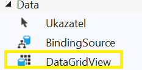
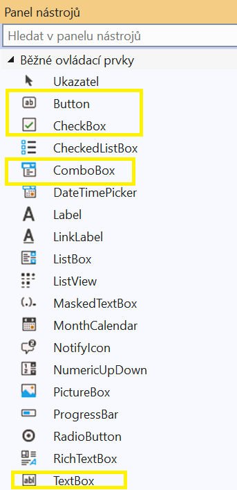
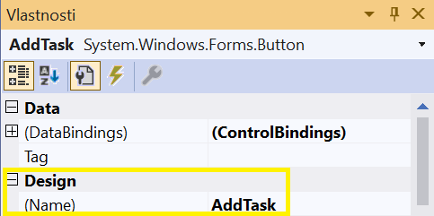
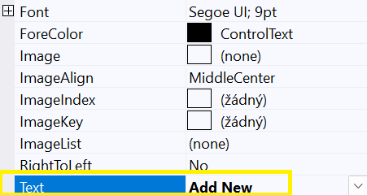

# WPF + WinForms TODO List


This project represents a TODO List, developed using WPF and WinForms.

We will demonstrate the process of creating this application step by step.


## Prerequisites

Before you start development, make sure you have the following tools installed:

1. **Visual Studio 2022**

If you don’t have it, download it from the official website: https://visualstudio.microsoft.com/cs/downloads/

During installation, select "Desktop development with .NET".


2. **.NET 8**

The latest version of .NET is required for this project to run.

## Downloading the project

You can download the entire project from GitHub:

1. Open the repository.
2. Click Code → Download ZIP.


3. Extract the ZIP file and open the project in Visual Studio.


## Functional requirements
- Viewing tasks.
- Adding tasks.
- Setting task type (Work, University, Personal, Other).
- Setting task status (Completed/Not completed).
- Removing tasks.
- Editing tasks.
- Saving tasks to a file (JSON).
- Loading tasks from a file (JSON).


# Creating a TODO List in WPF
## Designing the Interface in XAML
Pay attention to indentation. "<" - marks the start of a tag, "/>"" or "</" - marks the end of a tag.

### Window

The Window serves as the main container where we will gradually add and nest other elements. It is the foundation of the application—without it, the desktop application wouldn't be displayed.

- **`x:Class`** – This refers to the class associated with the XAML file. In our case, it points to the `MainWindow` class within the `TodoListWpf` namespace.
- **`xmlns, xmlns:x`** – These define the XAML schema. The URLs provide the source of tag definitions. Without them, the XAML tags wouldn't be recognized by the program. The URLs may change when using different libraries.
- **`Title`** – The title of the application.
- **`Height, Width`** – Specifies the window's height and width.
- **`Background`** – Defines the background color of the window in hexadecimal format.
- **`FontFamily`** – Specifies the font for the main window and all its elements.
- **`FontSize`** – Determines the font size.
- **`ForeGround`** – Sets the text color in hexadecimal format.
- **`HorizontalAlignment`** – Defines the alignment of the application window on the user's screen.
```xaml
<Window
    x:Class="TodoListWpf.MainWindow"
    xmlns="http://schemas.microsoft.com/winfx/2006/xaml/presentation"
    xmlns:x="http://schemas.microsoft.com/winfx/2006/xaml"
    Title="TODO List"
    Height="600"
    Width="700"
    Background="#1E1E1E"
    FontFamily="Segoe UI"
    FontSize="14"
    Foreground="#CCCCCC"
    HorizontalAlignment="Center"
    VerticalAlignment="Center">
    <!--Paste next code here-->
</Window>
```

### Grid

The **Grid** is an invisible grid that occupies the entire window space and helps us position elements.

- **`Grid Margin`** – Defines the margin of the grid, and therefore, the spacing between elements and the window edges.
- **`Grid.RowDefinitions`** – A paired tag used for directly positioning elements.

Since we want to divide our window into three horizontal sections, we need to define three rows where our elements will be placed:

1. **First RowDefinition** – `Height="*"` means that the row will take up **1/n** of the window space, where `n` is the total number of rows. In our case, it will occupy **one-third** of the window space.
2. **Second and Third Rows** – `Height="Auto"` means that the row height will automatically adjust based on the content.
```
<Grid Margin="10">
    <Grid.RowDefinitions>
        <RowDefinition
            Height="*"/>
        <RowDefinition
            Height="Auto"/>
        <RowDefinition
            Height="Auto"/>
    </Grid.RowDefinitions>
    <!--Paste next code here-->
</Grid>
```

### DataGrid

The **DataGrid** is a table where we will display the list of tasks.

- **`x:Name`** – The name of a specific element. By naming the tag, we can later access it in the logic part of the program (`MainWindow`) as a C# object.
- **`Grid.Row`** – Specifies the row from the previous code block where the element will be located (indexing starts from `0`).
- **`AutoGenerateColumns`** – Determines whether columns should be automatically generated based on the data collection provided. Since we only need to display specific properties of the `TaskItem` class (which we will create later), this is set to `False`.
- **`CanUserAddRows`** – Allows users to directly add records to the table. In our case, records will be added using different methods, so this is set to `False`.
- **`IsReadOnly`** – Defines whether users can edit the table directly. Since modifications will be handled differently, this is set to `True`.
- **`BorderBrush`** – Sets the border color of the table.
- **`BorderThickness`** – Defines the border width of the table.
- **`SelectionChanged`** – Specifies a method to handle the event when a user selects a row. If no row is selected, the value is `null`. We will implement this method later.

```xaml
<DataGrid
    x:Name="dataGridTasks"
    Grid.Row="0"
    AutoGenerateColumns="False"
    CanUserAddRows="False"
    IsReadOnly="True"
    Background="#2D2D30"
    Foreground="#CCCCCC"
    BorderBrush="#3E3E42"
    BorderThickness="1"
    SelectionChanged="DataGridTasks_SelectionChanged">
    <!--Paste next code here-->
</DataGrid>
```

**DataGrid.Resources** defines where the **DataGrid** should retrieve style definitions from.

- **`Style`** – A tag for defining styles (acts as a 'style command').
- **`TargetType`** – Specifies what will be styled.
- **`Setter Property, Value`** – Defines what property should be set and to what value.
- **`Style.Triggers`** – A style trigger.

Within the **`Style.Triggers`** tags, we can define individual triggers.
For example, if the **`IsSelected`** property of a **DataGrid** cell is `true` (meaning the cell is selected),
then the trigger will automatically change the **border color** to **yellow**.
```xaml
<DataGrid.Resources>
    <Style TargetType="DataGridColumnHeader">
        <Setter Property="Background" Value="#3E3E42"/>
        <Setter Property="Foreground" Value="#CCCCCC"/>
        <Setter Property="BorderBrush" Value="#565656"/>
    </Style>
    <Style TargetType="DataGridCell">
        <Setter Property="Background" Value="#2D2D30"/>
        <Setter Property="Foreground" Value="#CCCCCC"/>
        <Setter Property="BorderBrush" Value="#565656"/>
    <Style.Triggers>
        <Trigger Property="IsSelected" Value="True">
            <Setter Property="BorderBrush" Value="Yellow"/>
        </Trigger>
    </Style.Triggers>
    </Style>
    <Style TargetType="DataGridRow">
        <Setter Property="Background" Value="#2D2D30"/>
        <Setter Property="Foreground" Value="#CCCCCC"/>
        <Setter Property="BorderBrush" Value="#565656"/>
    </Style>
</DataGrid.Resources>
<!--Paste next code here-->
```


 **DataGrid.Columns** defines the columns of the table.

- **`DataGridTextColumn`** – Defines a column that contains text.
- **`DataGridCheckBoxColumn`** – Defines a column that contains checkboxes.
- **`Binding`** – Determines whether the table is bound to a collection of objects.

In our case, the **DataGrid** is bound to a **task list**, which is a collection of objects of the `TaskItem` class.
Each `TaskItem` has the following attributes:
- **`Title (string)`**
- **`Type (string)`**
- **`Done (CheckBox, i.e., boolean + null)`**

The **DataGrid** recognizes the list of `TaskItem` objects using **binding** and automatically organizes them based on the corresponding column headers and attributes.

```xaml
<DataGrid.Columns>
    <!-- Column for task name -->
    <DataGridTextColumn
        Header="Title"
        Binding="{Binding Title}"
        Width="*"/>

    <!-- Column for task type -->
    <DataGridTextColumn
        Header="Type"
        Binding="{Binding Type}"
        Width="150"/>

    <!-- Column for task state -->
    <DataGridCheckBoxColumn
        Header="Done"
        Binding="{Binding IsDone}"
        Width="100"/>
</DataGrid.Columns>
```

### StackPanel

Similar to **Grid**, it is used for positioning elements. However, it is **one-dimensional**,
aligning elements either **vertically** (one below another) or **horizontally** (side by side) using the **`Orientation`** property.

- **`Margin`** – Defines spacing (in this order: **left, top, right, bottom**).
- **`TextBox`** – A text input field for users.
- **`ToolTip`** – A tooltip providing guidance to the user on how to use the text field.
  - The tooltip appears when the user hovers over the text field and holds the mouse there for a moment (no need to click).
- **`ComboBox`** – A dropdown list of selectable options.
- **`ComboBoxItem`** – Items in the ComboBox can be defined directly in XAML.
  - However, we **will not** use this method, as our options will be loaded dynamically using the `TaskType` enumeration,
    which serves as the data source (we will implement this later).
- **`CheckBox`** – A checkbox input.

```xaml
<!--Paste this code after </DataGrid> -->
<StackPanel
    Grid.Row="1"
    Orientation="Vertical"
    Margin="0,10,0,0">

    <!-- Panel with input elements -->
    <StackPanel
        Orientation="Horizontal"
        HorizontalAlignment="Center"
        Margin="0,0,0,5">

        <!-- TextBox for task name -->
        <TextBox
            x:Name="textBoxTask"
            Width="200"
            Height="25"
            Margin="5"
            ToolTip="Enter a new or updated task"
            Background="#2D2D30"
            Foreground="#CCCCCC"
            BorderBrush="#3E3E42"
            BorderThickness="1"/>

        <!-- ComboBox for task type selection -->
        <ComboBox
            x:Name="comboBoxTaskType"
            Width="150"
            Height="25"
            Margin="5"
            Background="#CCCCCC"
            Foreground="#2D2D30"
            BorderBrush="#3E3E42"
            BorderThickness="1"
            ToolTip="Select task type">
        </ComboBox>

        <!-- CheckBox for setting the task status -->
        <CheckBox
            x:Name="checkBoxIsDone"
            Content="Done"
            VerticalAlignment="Center"
            Margin="5"
            Foreground="#CCCCCC"/>
    </StackPanel>
    <!--Paste next code here-->
</StackPanel>
```

**Button** - a button for user interaction.

- **`Content`** – Defines the text displayed on the button.
- **`Click`** – Specifies the event triggered when the button is clicked.
- **`Cursor`** – Determines the mouse cursor icon when hovering over the button.

```xaml
<!-- Button panel (add/update/delete task) -->
<StackPanel
    Orientation="Horizontal"
    HorizontalAlignment="Center">

    <Button
        Content="Add New Task"
        Click="AddTask_Click"
        Height="50"
        Width="150"
        Margin="10,0"
        FontSize="16"
        FontWeight="SemiBold"
        Background="#3E3E42"
        Foreground="#CCCCCC"
        BorderBrush="#565656"
        Cursor="Hand" />

    <Button
        Content="Update Task"
        Click="UpdateTask_Click"
        Height="50"
        Width="150"
        Margin="10,0"
        FontSize="16"
        FontWeight="SemiBold"
        Background="#3E3E42"
        Foreground="#CCCCCC"
        BorderBrush="#565656"
        Cursor="Hand" />

    <Button
        Content="Delete Task"
        Click="DeleteTask_Click"
        Height="50"
        Width="150"
        Margin="10,0"
        FontSize="16"
        FontWeight="SemiBold"
        Background="#3E3E42"
        Foreground="#CCCCCC"
        BorderBrush="#565656"
        Cursor="Hand" />
</StackPanel>

<!-- Panel for file operations -->
<StackPanel
    Grid.Row="2"
    Orientation="Horizontal"
    HorizontalAlignment="Center"
    Margin="0,10,0,0">

    <Button
        Content="Save to File"
        Click="SaveTasks_Click"
        Height="50"
        Width="150"
        Margin="10,0"
        FontSize="16"
        FontWeight="SemiBold"
        Background="#3E3E42"
        Foreground="#CCCCCC"
        BorderBrush="#565656"
        Cursor="Hand" />

    <Button
        Content="Load from File"
        Click="LoadTasks_Click"
        Height="50"
        Width="150"
        Margin="10,0"
        FontSize="16"
        FontWeight="SemiBold"
        Background="#3E3E42"
        Foreground="#CCCCCC"
        BorderBrush="#565656"
        Cursor="Hand" />
</StackPanel>
```

## **Creating Program Logic**

### Architecture


### Event-Driven workflow


#### **Creating the `TaskItem` Record and enum `TaskType`**

In our solution  we will create a new file named `TaskItem`.

To do this:
1. Right-click anywhere in the **Solution Explorer** panel (folder view).
   - **Do not** click on the `obj` or `bin` folders.
   - A good alternative is right-clicking on `ToDoListWpf.csproj`.
2. Select **Add -> New File**.
3. Rename the new file to **`TaskItem.cs`**.


Now we can implement the behavior of these two types. We will not define them as **classes** unnecessarily,
because given their role in the program logic, it is not needed and might even be counterproductive.

We need to define **which namespace** we are working in:
```
namespace ToDoListWpf;
```

Then, we create a **record** type called `TaskItem` with the following properties:

- **`Id`** (`Guid`) – A globally unique identifier.
- **`Title`** (`string`) – Represents the task description in the To-Do List.
- **`Type`** (`TaskType`) – Specifies what category the task belongs to (we will define the `TaskType` enum below).
- **`IsDone`** (`bool`) – A flag that by default indicates that the task is **not yet completed**.

**What is a Record?**

In C#, a **record** can be considered a class, but it is primarily a **structured type**
designed for storing **immutable data**.

More details: https://learn.microsoft.com/en-us/dotnet/csharp/fundamentals/types/records


**Defining the `TaskType` Enum**

Next, we create an **enum** called `TaskType`, which contains named values assigned to whole numbers.

**What is an Enum?**

An **enum** is a **value type** used to represent a selection from a set of **mutually exclusive values**
or a **combination of choices**.

By default, **enum values** are assigned **integer values starting from `0`**,
but this behavior can be customized if needed.

More details: https://learn.microsoft.com/en-us/dotnet/csharp/language-reference/builtin-types/enum
```csharp
namespace TodoListWpf;

/// <summary>
/// Represents a task.
/// </summary>
/// <param name="Id">Task identifier.</param>
/// <param name="Title">Task title.</param>
/// <param name="Type">Task type.</param>
/// <param name="IsDone">Task status.</param>
public record TaskItem(Guid Id, string Title, TaskType Type = TaskType.Other, bool IsDone = false);

/// <summary>
/// Represents the task type.
/// </summary>
public enum TaskType { Work = 0, University = 1, Personal = 2, Other = 3 }
```

Now we create a new file named **TaskService.cs**

This file will contain the following components:

- **`ITaskService`** – An interface defining necessary methods.
- **`TaskService : ITaskService`** – A class implementing the interface.
- **`OperationResult`** – A record used for operation validation.

Although **`ITaskService`** is not strictly necessary, it helps clarify the logic
and define the required methods for the application to function correctly.

The methods within **`ITaskService`** will return values of type **`OperationResult`**,
which allows us to verify whether operations have been executed successfully or not.

We will define **`OperationResult`** later.
```csharp
using System.Collections.ObjectModel;

namespace TodoListWpf;

public interface ITaskService
{
    /// <summary>
    /// Represents collection of tasks.
    /// </summary>
    public ObservableCollection<TaskItem> Tasks { get; }

    /// <summary>
    /// Adds a new task.
    /// </summary>
    public OperationResult AddTask(string title, TaskType type, bool isDone);

    /// <summary>
    /// Updates the specified task.
    /// </summary>
    public OperationResult UpdateTask(TaskItem task, string title, TaskType type, bool isDone);

    /// <summary>
    /// Deletes the specified task.
    /// </summary>
    public OperationResult DeleteTask(TaskItem task);

    /// <summary>
    /// Saves tasks to a file.
    /// </summary>
    public OperationResult SaveTasks();

    /// <summary>
    /// Loads tasks from a file.
    /// </summary>
    public OperationResult LoadTasks();
}
```

Before implementing **`ITaskService`**, we will create a **record type** called `OperationResult`.

This type provides two methods:

- **`Success`** – Returns a **boolean value (`true`)** indicating a successful operation.
- **`Failure`** – Returns a **boolean value (`false`)** along with an **`ErrorMessage`**,
  which can be either `null` or a `string`.

The methods are called based on **`if` statements** in the code,
and the content of **`ErrorMessage`** is also defined for specific cases based on conditions within **`if` statements**.
```csharp
/// <summary>
/// Represents the result of an operation, e.g. when adding, updating, or deleting a task.
/// Contains information about whether the operation was successful, and an optional error message if the operation failed.
/// </summary>
public record OperationResult
{
    public bool IsSuccess { get; }

    public string? ErrorMessage { get; }

    /// <summary>
    /// Private constructor ensures only objects created within class exist throughout the program.
    /// Currently, only objects generated by .Success and .Failure static methods exist and cannot be further modified by the caller.
    /// </summary>
    /// <param name="isSuccess">Set to true if success, set to false if failure.</param>
    /// <param name="errorMessage">Set to null if success, set to a value if failure.</param>
    private OperationResult(bool isSuccess, string? errorMessage) => (IsSuccess, ErrorMessage) = (isSuccess, errorMessage);

    /// <summary>
    /// Creates and returns a successful operation result.
    /// </summary>
    public static OperationResult Success() => new(true, null);

    /// <summary>
    /// Creates and returns a failed operation result with the specified error message.
    /// </summary>
    /// <param name="errorMessage">Error message describing the reason for the operation's failure.</param>
    public static OperationResult Failure(string errorMessage) => new(false, errorMessage);
}
```


We will predefine the implementation of **`ITaskService`** in the form of a class **`TaskService`**.

Since our application will be able to **save and load tasks** to/from a file,
we need to:

- **Create the file**
- **Name it**
- **Define its path**

The **`TaskService`** class will internally **maintain a collection of tasks**,
allowing direct manipulation of tasks within the application.
```csharp
/// <summary>
/// Service for managing tasks.
/// </summary>
public class TaskService(string path = "tasks.json") : ITaskService
{
    /// <inheritdoc/>
    public ObservableCollection<TaskItem> Tasks { get; } = [];

    /// <inheritdoc/>
    public OperationResult AddTask(string title, TaskType type, bool isDone)
    {
       throw new NotImplementedException();
    }

    /// <inheritdoc/>
    public OperationResult UpdateTask(TaskItem task, string title, TaskType type, bool isDone)
    {
        throw new NotImplementedException();
    }

    /// <inheritdoc/>
    public OperationResult DeleteTask(TaskItem task)
    {
        throw new NotImplementedException();
    }

    /// <inheritdoc/>
    public OperationResult SaveTasks()
    {
        throw new NotImplementedException();
    }

    /// <inheritdoc/>
    public OperationResult LoadTasks()
    {
        throw new NotImplementedException();
    }
}
```

We open the **`MainWindow.xaml.cs`** file to initialize the user interface
defined in **`MainWindow.xaml`**.

This file will also contain **event handlers** (see presentation).
These event handlers will be linked to methods in the **`TaskService`** class.

When creating the **`MainWindow`** class, we need to define a **private object** `_taskService`
as an instance of the **`TaskService`** class.

This object is necessary for managing tasks in both the **foreground** and **background** of the application. However, it **should not be accessible** to classes outside `MainWindow`.

Then we must set the data sources for:

- **The `DataGrid`** – Using the **task collection** maintained by `_taskService`.
- **The `ComboBox`** – Using the **`TaskTypes`** enum defined earlier.

The last step in **window initialization** is setting the **default value** of the **ComboBox** to **`Other`** (`TaskType.Other`).
In addition to the functions defined in `_taskService` and linked to the UI in the **XAML file**, we also need to implement the **`DataGridTasks_SelectionChanged()`** function.
- This function was set as an **event handler** in XAML.
- It will be triggered when the user **clicks on a row** in the **DataGrid**.
```csharp
using System.Windows;
using System.Windows.Controls;

namespace TodoListWpf;

/// <summary>
/// Interaction logic for MainWindow.xaml.
/// </summary>
public partial class MainWindow : Window
{
    private readonly ITaskService _taskService = new TaskService();

    public MainWindow()
    {
        InitializeComponent();

        // Setting data sources.
        dataGridTasks.ItemsSource = _taskService.Tasks;
        comboBoxTaskType.ItemsSource = Enum.GetValues(typeof(TaskType));

        // Setting the default value for ComboBox.
        comboBoxTaskType.SelectedItem = TaskType.Other;
    }

    /// <summary>
    /// Adds a new task if a title is provided.
    /// </summary>
    private void AddTask_Click(object sender, RoutedEventArgs e)
    {

    }

    /// <summary>
    /// Updates the selected task with new text from the text field.
    /// </summary>
    private void UpdateTask_Click(object sender, RoutedEventArgs e)
    {

    }

    /// <summary>
    /// Deletes the selected task.
    /// </summary>
    private void DeleteTask_Click(object sender, RoutedEventArgs e)
    {

    }

    /// <summary>
    /// Displays the selected task in the input fields when the selection in the DataGrid changes.
    /// </summary>
    private void DataGridTasks_SelectionChanged(object sender, SelectionChangedEventArgs e)
    {

    }

    /// <summary>
    /// Saves tasks to a file.
    /// </summary>
    private void SaveTasks_Click(object sender, RoutedEventArgs e)
    {

    }

    /// <summary>
    /// Loads tasks from a file.
    /// </summary>
    private void LoadTasks_Click(object sender, RoutedEventArgs e)
    {

    }
}
```

### Add Task  
Let's start with the most basic method.

1. **File `MainWindow.xaml.cs`, method `private void AddTask_Click(object sender, RoutedEventArgs e)`**  
   - Retrieve data from the **user interface, cast, and assign to corresponding variables**:  
       - Textbox  
       - ComboBox  
       - CheckBox  
   - Try to convert the collected data into a `TaskItem` object using `_taskService.AddTask(title, type, isDone)` and store the result of the operation in the variable `result`.

```csharp
string title = textBoxTask.Text.Trim();
TaskType type = (TaskType)comboBoxTaskType.SelectedItem;
bool isDone = checkBoxIsDone.IsChecked == true;

OperationResult result = _taskService.AddTask(title, type, isDone);
```

2. **File `TaskService.cs`, class `TaskService`, method `public OperationResult AddTask(string title, TaskType type, bool isDone)`**  
   - Handle unwanted cases with `if` statements and return `OperationResult.Failure()` with a **corresponding** ErrorMessage:  
      - `title` is invalid  
   - An object `TaskItem` with the same `TaskItem.Title` and `TaskItem.Type` already exists in the collection `TaskService.Tasks`.  
      - `Tasks.Any(...)` requires a **predicate in the form of a lambda function** (e.g., `x => x % 2 == 0`). The `Any` method **iterates** through our collection and applies our predicate lambda function to **each object** `TaskItem` in the `Tasks` collection (variable `x`). If the predicate is true for **at least one** object, it returns `true`; otherwise, it returns `false`.  
      - `x => x.Title.Equals(title, StringComparison.OrdinalIgnoreCase) && x.Type == type)` - a predicate, a lambda function. It compares (`x.Title.Equals(...)`) `x.Title` with `title` ignoring case (`StringComparison.OrdinalIgnoreCase`) and simultaneously compares the equality of the values of `x.Type` and `type`.  

   - If no unwanted case occurs, convert the data into a new `TaskItem` object, add it to the collection `TaskService.Tasks`, and return `OperationResult.Success()`.
```csharp
public OperationResult AddTask(string title, TaskType type, bool isDone)
{
    if (string.IsNullOrEmpty(title))
    {
        return OperationResult.Failure("Title cannot be empty.");
    }
    if (Tasks.Any(x => x.Title.Equals(title, StringComparison.OrdinalIgnoreCase) && x.Type == type))
    {
            return OperationResult.Failure("Task with same title and task type already exists.");
    }


    TaskItem taskItem = new TaskItem(Guid.NewGuid(), title, type, isDone);
    Tasks.Add(taskItem);
    return OperationResult.Success();
}
```

3. **File `MainWindow.xaml.cs`, method `private void AddTask_Click(object sender, RoutedEventArgs e)`**  
   - Based on `result`, display or do not display the ErrorMessage.  
   - Use the `Clear()` method to empty `TextBoxTask`, preparing it for further user input.

```csharp
if (!result.IsSuccess)
{
    MessageBox.Show(result.ErrorMessage, "Warning", MessageBoxButton.OK, MessageBoxImage.Warning);
    return;
}

textBoxTask.Clear();
```

---

### DataGridTasks_SelectionChanged  
Promised method.  
**File `MainWindow.xaml.cs`, method `private void DataGridTasks_SelectionChanged(object sender, SelectionChangedEventArgs e)`**

1. Handle the case when no object is selected (i.e., no row is chosen in the table), yet the method is invoked.  
   - The solution is to exit the function using `return`.

2. Save and cast the existing object to `TaskItem` into the variable `task`.

3. Assign the individual values to the **corresponding attributes**.

```csharp
private void DataGridTasks_SelectionChanged(object sender, SelectionChangedEventArgs e)
{
    if (dataGridTasks.SelectedItem is null)
    {
        return;
    }

    TaskItem task = (TaskItem)dataGridTasks.SelectedItem;

    textBoxTask.Text = task.Title;
    comboBoxTaskType.SelectedItem = task.Type;
    checkBoxIsDone.IsChecked = task.IsDone;
}
```

---

### Update Task  
1. **File `MainWindow.xaml.cs`, method `private void UpdateTask_Click(object sender, RoutedEventArgs e)`**  
   - Use an `if` statement to handle the case when the object to update is not a `TaskItem` and at the same time try to store the object in the variable `task`:  
       - If the object **is** of type `TaskItem`, store it in the variable using `TaskItem task`  
       - If the object **is not** of type `TaskItem`, display an appropriate message using `MessageBox.Show()` and exit the function with `return;`  
   - If this case does not occur, cast and store user inputs into **corresponding variables** (similar to the `AddTask_Click` method).  
   - Try to convert this data into an updated task using `_taskService.UpdateTask(task, title, type, isDone)` and store the operation result in the variable `result`.

```csharp
if (dataGridTasks.SelectedItem is not TaskItem task)
{
    MessageBox.Show("Select task to update.", "Warning", MessageBoxButton.OK, MessageBoxImage.Warning);
    return;
}

string title = textBoxTask.Text.Trim();
TaskType type = (TaskType)comboBoxTaskType.SelectedItem;
bool isDone = checkBoxIsDone.IsChecked == true;

OperationResult result = _taskService.UpdateTask(task, title, type, isDone);
```
2. **File `TaskService.cs`, class `TaskService`, method `public OperationResult UpdateTask(TaskItem task, string title, TaskType type, bool isDone)`**  
   - Handle unwanted cases with `if` statements and return `OperationResult.Failure()` with a **corresponding** ErrorMessage:  
      - The object is `null`  
      - `title` is invalid  
      - The `TaskItem` selected for update has no changed values.  
      - An object `TaskItem` with the same `task.Title`, `task.Type`, and `task.IsDone` already exists in the collection `TaskService.Tasks`.  
         - The predicate `x => x != task && x.Title.Equals(title, StringComparison.OrdinalIgnoreCase) && x.Type == type && x.IsDone == isDone` tests whether the object `x` from the `Tasks` interface (`Tasks.Any(...)`) **is not** the `TaskItem` selected for update, but still has the same values.  
   - Since `TaskItem` objects are **indexed**, we can more easily access them and check if the objects really exist.  
      - **If the search for the index (`Tasks.IndexOf(task)`) returns `-1`, the object does not exist.**  
   - **Only when none of the unwanted cases occur**, can we change the existing `TaskItem` object in the `TaskService.Tasks` collection to a new `TaskItem` object **with new values but the same index** and return `OperationResu

```csharp
public OperationResult UpdateTask(TaskItem task, string title, TaskType type, bool isDone)
{
    if (task is null)
    {
        return OperationResult.Failure("Task cannot be null.");
    }

    if (string.IsNullOrEmpty(title))
    {
        return OperationResult.Failure("Title cannot be empty.");
    }
    if (task.Title.Equals(title, StringComparison.OrdinalIgnoreCase) && task.Type == type && task.IsDone == isDone)
    {
        return OperationResult.Failure("Task cannot be updated as it was not modified.");
    }

    if (Tasks.Any(x => x != task && x.Title.Equals(title, StringComparison.OrdinalIgnoreCase) && x.Type == type && x.IsDone == isDone))
    {
        return OperationResult.Failure("Task with same properties already exists.");
    }


    int index = Tasks.IndexOf(task);
    if (index == -1)
    {
        return OperationResult.Failure("Task not found.");
    }

    Tasks[index] = new TaskItem(task.Id, title, type, isDone);
    return OperationResult.Success();
}
```

3. **File `MainWindow.xaml.cs`, method `private void UpdateTask_Click(object sender, RoutedEventArgs e)`**  
   - Based on `result`, display or do not display the ErrorMessage.  
   - Use the `Clear()` method to empty `TextBoxTask`, preparing it for further user input.

```csharp
if (!result.IsSuccess)
{
    MessageBox.Show(result.ErrorMessage, "Warning", MessageBoxButton.OK, MessageBoxImage.Warning);
}
textBoxTask.Clear();
```

---

### Delete Task  
1. **File `MainWindow.xaml.cs`, method `private void DeleteTask_Click(object sender, RoutedEventArgs e)`**  
   - Use an `if` statement to handle the case when the selected object for deletion is not a `TaskItem` and at the same time try to store the object in the variable `task`:  
       - If the object **is** of type `TaskItem`, store it in the variable using `TaskItem task`  
       - If the object **is not** of type `TaskItem`, display an appropriate message using `MessageBox.Show()` and exit the function with `return;`  
   - Attempt to delete the `TaskItem` object stored in the variable `task` using `_taskService.DeleteTask(task)` and store the result in the variable `result`.

```csharp
if (dataGridTasks.SelectedItem is not TaskItem task)
{
    MessageBox.Show("Select task to delete.", "Warning", MessageBoxButton.OK, MessageBoxImage.Warning);
    return;
}

OperationResult result = _taskService.DeleteTask(task);
```

2. **File `TaskService.cs`, class `TaskService`, method `public OperationResult DeleteTask(TaskItem task)`**  
   - Handle unwanted cases with `if` statements and return `OperationResult.Failure()` with a **corresponding** ErrorMessage if the `TaskItem` object in the variable `task`:  
        - is `null`  
        - is not contained in the collection `TaskService.Tasks`  
   - If the `TaskItem` object is valid, delete it from the collection `TaskService.Tasks` using `Tasks.Remove(task)` and return `OperationResult.Success()`.

```csharp
public OperationResult DeleteTask(TaskItem task)
{
    if (task is null)
    {
        return OperationResult.Failure("Task cannot be null.");
    }

    if (!Tasks.Contains(task))
    {
        return OperationResult.Failure("Task not found.");
    }

    Tasks.Remove(task);
    return OperationResult.Success();
}
```

3. **File `MainWindow.xaml.cs`, method `private void DeleteTask_Click(object sender, RoutedEventArgs e)`**  
   - Based on `result`, display or do not display the ErrorMessage.  
   - Use the `Clear()` method to empty `TextBoxTask`, preparing it for further user input.

```csharp
if (!result.IsSuccess)
{
    MessageBox.Show(result.ErrorMessage, "Warning", MessageBoxButton.OK, MessageBoxImage.Warning);
}
textBoxTask.Clear();
```

### Save Tasks
1. File `MainWindow.xaml.cs`, method `private void SaveTasks_Click(object sender, RoutedEventArgs e)`
    - Attempt to save tasks using `_taskService.SaveTasks()` and store the result in the variable `result`.
    - Based on `result`, the corresponding ErrorMessage is shown/not shown.
```csharp
/// <summary>
/// Saves tasks to a file.
/// </summary>
private void SaveTasks_Click(object sender, RoutedEventArgs e)
{
    OperationResult result = _taskService.SaveTasks();
    if (!result.IsSuccess)
    {
        MessageBox.Show(result.ErrorMessage, "Warning", MessageBoxButton.OK, MessageBoxImage.Warning);
    }
}
```
2. File `TaskService.cs`, class `TaskService`, method `public OperationResult SaveTasks()`
    - Attempt to save tasks to a JSON file (`try` block)
        - The JSON string is saved to the `json` variable using `JsonSerializer.Serialize(...)`.
        - `Tasks` is the object (our task collection) designated for serialization.
        - `new JsonSerializerOptions()` creates an object intended for setting up JSON serialization. `WriteIndented = true` ensures that the JSON will have indentation and line breaks.
        - `File.WriteAllText(path, json)` writes the `json` to the file located at the `path`, which is set by default in the constructor of `TaskService`.
    - Error handling (`catch` block)
        - In case of any error, the same `OperationResult.Failure(...)` is returned.
    - On success, the function returns `OperationResult.Success()`.


```csharp
/// <inheritdoc/>
public OperationResult SaveTasks()
{
    try
    {
        string json = JsonSerializer.Serialize(Tasks, new JsonSerializerOptions() { WriteIndented = true });
        File.WriteAllText(path, json);
    }
    catch
    {
        return OperationResult.Failure("Tasks could not be saved to file.");
    }

    return OperationResult.Success();
}
```

### Load Tasks
1. File `MainWindow.xaml.cs`, method `private void LoadTasks_Click(object sender, RoutedEventArgs e)`
    - Attempt to load tasks using `_taskService.LoadTasks()` and store the result in the variable `result`.
    - Based on `result`, the corresponding ErrorMessage is shown/not shown.
```csharp
/// <summary>
/// Loads tasks from a file.
/// </summary>
private void LoadTasks_Click(object sender, RoutedEventArgs e)
{
    OperationResult result = _taskService.LoadTasks();
    if (!result.IsSuccess)
    {
        MessageBox.Show(result.ErrorMessage, "Warning", MessageBoxButton.OK, MessageBoxImage.Warning);
    }
}
```
2. File `TaskService.cs`, class `TaskService`, method `public OperationResult LoadTasks()`
    - If the file does not exist, it is created using `File.WriteAllText()` (at the path set by default `string path = tasks.json`) with empty content (an empty list).
    - `ReadAllText(json)` reads the entire content of the file into the `json` variable as a string.
    - Deserialization and adding tasks to the collection
        - `?` after `<TaskItem>` allows for a `null` value.
        - `JsonSerializer.Deserialize<...>(...)` **deserializes** the JSON string into `TaskItem` objects and adds them to the **local collection** `tasks`. In case of any error, such as an incorrect format, it returns `null`.
    - Handling the unwanted case (a `null` value) using an `if` statement and returning `OperationResult.Failure(...)`.
    - Loading the current tasks
        - Clearing the old **class-level collection** `Tasks` that is maintained by the `_taskService` object during the program's execution.
        - Adding current `TaskItem` objects from the **local collection** `tasks` to the **class-level collection** `Tasks`.
        - Returning `OperationResult.Success()`.
```csharp
/// <inheritdoc/>
public OperationResult LoadTasks()
{
    if (!File.Exists(path))
    {
        File.WriteAllText(path, "[]");
    }

    string json = File.ReadAllText(path);

    ObservableCollection<TaskItem>? tasks = JsonSerializer.Deserialize<ObservableCollection<TaskItem>>(json);
    if (tasks is null)
    {
        return OperationResult.Failure("Tasks could not be loaded from file.");
    }

    Tasks.Clear();
    foreach (TaskItem task in tasks)
    {
        Tasks.Add(task);
    }

    return OperationResult.Success();
}
```


# Creating a To-Do List in WinForms
Creating the application is significantly simpler. The program logic will be very similar, in most cases identical. The graphical user interface can be created in the `Form1.cs[Design]` file.

## Creating the GUI
When opening `Form1.cs[Design]`, on the left side, there is the **Toolbox**.

1. From the **Data** folder, drag the **DataGridView** component onto the **Form1** window so that its position matches the **DataGrid** in the previous application.
   
2. From the **Common Controls** folder, drag the **TextBox, ComboBox, CheckBox, and Button** components onto the window so that they match the previous application.
   
3. To simplify, rename the user interface components as desired for their event handlers and change the displayed text accordingly.
   - Click on a UI component to access the **Properties** panel at the bottom left for renaming.
   - For DataGrid, it will be more complex; the SelectionChanged method can be set in the events panel, which will be demonstrated in class. Screenshots of the properties and events used for DataGrid are in the `images` folder.
   
   
4. Code for interacting with these UI components will be initialized in the `Form1.cs` file by double-clicking the UI component in the **Form1** window inside `Form1.cs[Design]`.

## Implementing Logic
The `TaskService.cs` and `TaskItem.cs` files remain unchanged. Simply create them and copy-paste the content from the previous application.

# Logic of Form1.cs
Ensure the inclusion of `using System.ComponentModel;`.
The beginning of the file, object creation for `_taskService` class `TaskService`, and data source setup should look as follows:

```csharp
using System.ComponentModel;

namespace TodoListWinForms;

public partial class Form1 : Form
{
    private readonly ITaskService _taskService = new TaskService();

    public Form1()
    {
        InitializeComponent();

        // Setting up data sources.
        dataGridTasks.DataSource = new BindingList<TaskItem>(_taskService.Tasks);
        dataGridTasks.AutoGenerateColumns = false;
        comboBoxTaskType.DataSource = Enum.GetValues(typeof(TaskType));

        // Setting the default value for ComboBox.
        comboBoxTaskType.SelectedItem = TaskType.Other;
    }
```

# Creating a To-Do List in WinForms
Creating the application is significantly simpler. The program logic will be very similar, in most cases identical. The graphical user interface can be created in the `Form1.cs[Design]` file.

## Creating the GUI
When opening `Form1.cs[Design]`, on the left side, there is the **Toolbox**.

1. From the **Data** folder, drag the **DataGridView** component onto the **Form1** window so that its position matches the **DataGrid** in the previous application.
   
2. From the **Common Controls** folder, drag the **TextBox, ComboBox, CheckBox, and Button** components onto the window so that they match the previous application.
   
3. To simplify, rename the user interface components as desired for their event handlers and change the displayed text accordingly.
   - Click on a UI component to access the **Properties** panel at the bottom left for renaming.
   - For DataGrid, it will be more complex; the SelectionChanged method can be set in the events panel, which will be demonstrated in class. Screenshots of the properties and events used for DataGrid are in the `images` folder.
   
   
4. Code for interacting with these UI components will be initialized in the `Form1.cs` file by double-clicking the UI component in the **Form1** window inside `Form1.cs[Design]`.

## Implementing Logic
The `TaskService.cs` and `TaskItem.cs` files remain unchanged. Simply create them and copy-paste the content from the previous application.

# Logic of Form1.cs
Ensure the inclusion of `using System.ComponentModel;`.
The beginning of the file, object creation for `_taskService` class `TaskService`, and data source setup should look as follows:

```csharp
using System.ComponentModel;

namespace TodoListWinForms;

public partial class Form1 : Form
{
    private readonly ITaskService _taskService = new TaskService();

    public Form1()
    {
        InitializeComponent();

        // Setting up data sources.
        dataGridTasks.DataSource = new BindingList<TaskItem>(_taskService.Tasks);
        dataGridTasks.AutoGenerateColumns = false;
        comboBoxTaskType.DataSource = Enum.GetValues(typeof(TaskType));

        // Setting the default value for ComboBox.
        comboBoxTaskType.SelectedItem = TaskType.Other;
    }
```

### DataGrid Functionality
1. `private void RefreshDataGrid()`
   - In WinForms, DataGrid does not update automatically with data changes, so this function must be set up. It will be called in almost every operation.

```csharp
 private void RefreshDataGrid()
 {
     dataGridTasks.DataSource = new BindingList<TaskItem>(_taskService.Tasks);
 }
```

2. `private void DataGridTasks_SelectionChanged(object sender, EventArgs e)`
   - Handles cases where the selected row index exceeds the number of objects in `_taskService.Tasks`.
   - Handles cases where the selected object is not a `TaskItem` object.
   - If valid, the `TaskItem` object is stored in the `selectedTask` variable.
   - `?` after `CurrentRow` handles cases where the selected object is `null`.
   - Distributes user input into the corresponding attributes of the `TaskItem` object.

```csharp
    private void DataGridTasks_SelectionChanged(object sender, EventArgs e)
    {
        if (dataGridTasks.CurrentRow?.Index >= _taskService.Tasks.Count)
        {
            return;
        }

        if (dataGridTasks.CurrentRow?.DataBoundItem is not TaskItem selectedTask)
        {
            return;
        }

        textBoxTask.Text = selectedTask.Title;
        comboBoxTaskType.SelectedItem = selectedTask.Type;
        checkBoxIsDone.Checked = selectedTask.IsDone;
    }
```

### Add Task
- The initialized button code for the Add Task function will look similar, but there are a few changes
- No need to cast the CheckBox value.
- `RefreshDataGrid()` must be called after the operation.

```csharp
 private void AddTask_Click(object sender, EventArgs e)
 {
     string title = textBoxTask.Text.Trim();
     TaskType type = (TaskType)comboBoxTaskType.SelectedItem!;
     bool isDone = checkBoxIsDone.Checked;

     OperationResult result = _taskService.AddTask(title, type, isDone);
     if (!result.IsSuccess)
     {
         MessageBox.Show(result.ErrorMessage, "Warning", MessageBoxButtons.OK, MessageBoxIcon.Warning);
         return;
     }

     RefreshDataGrid();
     textBoxTask.Clear();
 }
```

### Update Task
Modified `if` condition and DataGrid refresh.

```csharp
    private void UpdateTask_Click(object sender, EventArgs e)
    {
        if (dataGridTasks.CurrentRow?.DataBoundItem is not TaskItem task)
        {
            MessageBox.Show("Select a task to update.", "Warning", MessageBoxButtons.OK, MessageBoxIcon.Warning);
            return;
        }

        string title = textBoxTask.Text.Trim();
        TaskType type = (TaskType)comboBoxTaskType.SelectedItem!;
        bool isDone = checkBoxIsDone.Checked;

        OperationResult result = _taskService.UpdateTask(task, title, type, isDone);
        if (!result.IsSuccess)
        {
            MessageBox.Show(result.ErrorMessage, "Warning", MessageBoxButtons.OK, MessageBoxIcon.Warning);
            return;
        }

        RefreshDataGrid();
        textBoxTask.Clear();
    }
```

### Delete Task
Modified `if` condition and DataGrid refresh.

```csharp
    private void DeleteTask_Click(object sender, EventArgs e)
    {
        if (dataGridTasks.CurrentRow?.DataBoundItem is not TaskItem task)
        {
            MessageBox.Show("Select a task to delete.", "Warning", MessageBoxButtons.OK, MessageBoxIcon.Warning);
            return;
        }

        OperationResult result = _taskService.DeleteTask(task);
        if (!result.IsSuccess)
        {
            MessageBox.Show(result.ErrorMessage, "Warning", MessageBoxButtons.OK, MessageBoxIcon.Warning);
            return;
        }

        RefreshDataGrid();
        textBoxTask.Clear();
    }
```

### Save Tasks
Modification includes adding the `return;` statement.

```csharp
    private void SaveTasks_Click(object sender, EventArgs e)
    {
        OperationResult result = _taskService.SaveTasks();
        if (!result.IsSuccess)
        {
            MessageBox.Show(result.ErrorMessage, "Error", MessageBoxButtons.OK, MessageBoxIcon.Error);
            return;
        }
    }
```

### Load Tasks
Modification in DataGrid refresh.

```csharp
    private void LoadTasks_Click(object sender, EventArgs e)
    {
        OperationResult result = _taskService.LoadTasks();
        if (!result.IsSuccess)
        {
            MessageBox.Show(result.ErrorMessage, "Error", MessageBoxButtons.OK, MessageBoxIcon.Error);
        }

        RefreshDataGrid();
    }
```


     dataGridTasks.DataSource = new BindingLis
