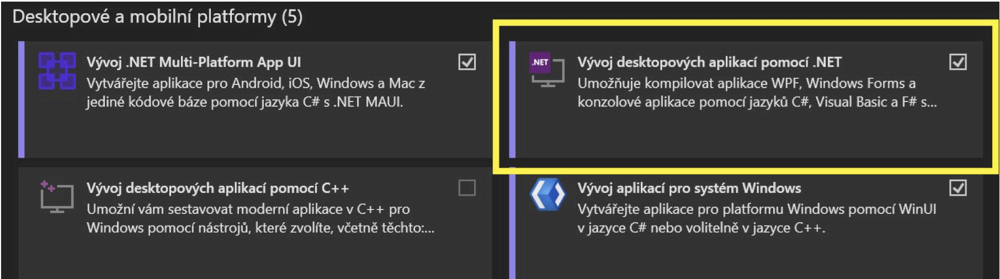

# WPF + WinForms TODO List

This project represents a TODO List, developed using WPF and WinForms.

We will demonstrate the process of creating this application step by step.

## Prerequisites

Before you start development, make sure you have the following tools installed:

1. **Visual Studio 2022**

If you don’t have it, download it from the official website: https://visualstudio.microsoft.com/cs/downloads/

During installation, select "Desktop development with .NET".

2. **.NET 8**

The latest version of .NET is required for this project to run.

## Downloading the project

You can download the entire project from GitHub:

1. Open the repository.
2. Click Code → Download ZIP.

3. Extract the ZIP file and open the project in Visual Studio.

## Features

### Adding tasks
### Setting task type (Work, University, Personal, Other)
### Setting task status (Completed/Not completed)
### Removing tasks
### Editing tasks
### Saving tasks to a file (JSON)
### Loading tasks from a file (JSON)