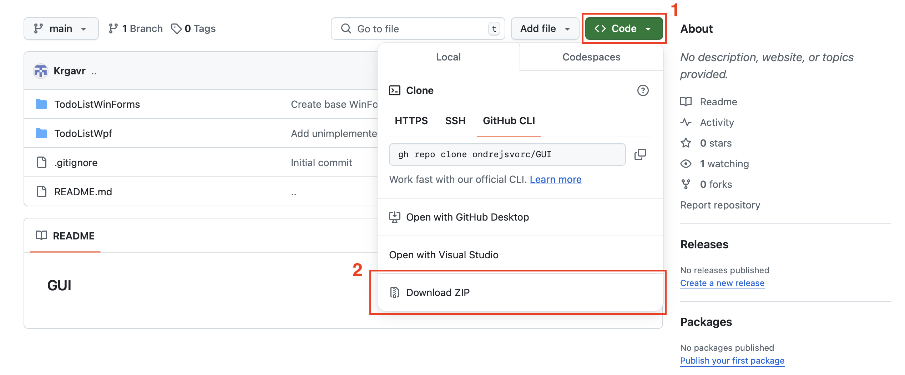

# WPF + WinForms TODO List

This project represents a TODO List, developed using WPF and WinForms.

We will demonstrate the process of creating this application step by step.


## Prerequisites

Before you start development, make sure you have the following tools installed:

1. **Visual Studio 2022**

If you don’t have it, download it from the official website: https://visualstudio.microsoft.com/cs/downloads/

During installation, select "Desktop development with .NET".


2. **.NET 8**

The latest version of .NET is required for this project to run.

## Downloading the project

You can download the entire project from GitHub:

1. Open the repository.
2. Click Code → Download ZIP.



3. Extract the ZIP file and open the project in Visual Studio.


## Features

### Adding tasks
### Setting task type (Work, University, Personal, Other)
### Setting task status (Completed/Not completed)
### Removing tasks
### Editing tasks
### Saving tasks to a file (JSON)
### Loading tasks from a file (JSON)

# Creating a DoToList in WPF
## Designing the Interface in XAML
Pay attention to indentation. "<" - marks the start of a tag, "/>"" or "</" - marks the end of a tag.

### Window

The Window serves as the main container where we will gradually add and nest other elements. It is the foundation of the application—without it, the desktop application wouldn't be displayed.

- **`x:Class`** – This refers to the class associated with the XAML file. In our case, it points to the `MainWindow` class within the `TodoListWpf` namespace.
- **`xmlns, xmlns:x`** – These define the XAML schema. The URLs provide the source of tag definitions. Without them, the XAML tags wouldn't be recognized by the program. The URLs may change when using different libraries.
- **`Title`** – The title of the application.
- **`Height, Width`** – Specifies the window's height and width.
- **`Background`** – Defines the background color of the window in hexadecimal format.
- **`FontFamily`** – Specifies the font for the main window and all its elements.
- **`FontSize`** – Determines the font size.
- **`ForeGround`** – Sets the text color in hexadecimal format.
- **`HorizontalAlignment`** – Defines the alignment of the application window on the user's screen.
```
<Window 
    x:Class="TodoListWpf.MainWindow"
    xmlns="http://schemas.microsoft.com/winfx/2006/xaml/presentation"
    xmlns:x="http://schemas.microsoft.com/winfx/2006/xaml"
    Title="TODO List"
    Height="600"
    Width="700"
    Background="#1E1E1E"
    FontFamily="Segoe UI"
    FontSize="14"
    Foreground="#CCCCCC"
    HorizontalAlignment="Center"
    VerticalAlignment="Center">
```

### Grid

The **Grid** is an invisible grid that occupies the entire window space and helps us position elements.  

- **`Grid Margin`** – Defines the margin of the grid, and therefore, the spacing between elements and the window edges.  
- **`Grid.RowDefinitions`** – A paired tag used for directly positioning elements.  

Since we want to divide our window into three horizontal sections, we need to define three rows where our elements will be placed:  

1. **First RowDefinition** – `Height="*"` means that the row will take up **1/n** of the window space, where `n` is the total number of rows. In our case, it will occupy **one-third** of the window space.  
2. **Second and Third Rows** – `Height="Auto"` means that the row height will automatically adjust based on the content.
```    
    <Grid Margin="10">
        <Grid.RowDefinitions>
            <RowDefinition 
                Height="*"/>
            <RowDefinition 
                Height="Auto"/>
            <RowDefinition 
                Height="Auto"/>
        </Grid.RowDefinitions>
```

### DataGrid

The **DataGrid** is a table where we will display the list of tasks.  

- **`x:Name`** – The name of a specific element. By naming the tag, we can later access it in the logic part of the program (`MainWindow`) as a C# object.  
- **`Grid.Row`** – Specifies the row from the previous code block where the element will be located (indexing starts from `0`).  
- **`AutoGenerateColumns`** – Determines whether columns should be automatically generated based on the data collection provided. Since we only need to display specific properties of the `TaskItem` class (which we will create later), this is set to `False`.  
- **`CanUserAddRows`** – Allows users to directly add records to the table. In our case, records will be added using different methods, so this is set to `False`.  
- **`IsReadOnly`** – Defines whether users can edit the table directly. Since modifications will be handled differently, this is set to `True`.  
- **`BorderBrush`** – Sets the border color of the table.  
- **`BorderThickness`** – Defines the border width of the table.  
- **`SelectionChanged`** – Specifies a method to handle the event when a user selects a row. If no row is selected, the value is `null`. We will implement this method later.  

```
        <DataGrid 
            x:Name="dataGridTasks"
            Grid.Row="0"
            AutoGenerateColumns="False"
            CanUserAddRows="False"
            IsReadOnly="True"
            Background="#2D2D30"
            Foreground="#CCCCCC"
            BorderBrush="#3E3E42"
            BorderThickness="1"
            SelectionChanged="DataGridTasks_SelectionChanged">
```

**DataGrid.Resources** defines where the **DataGrid** should retrieve style definitions from.  

- **`Style`** – A tag for defining styles (acts as a 'style command').  
- **`TargetType`** – Specifies what will be styled.  
- **`Setter Property, Value`** – Defines what property should be set and to what value.  
- **`Style.Triggers`** – A style trigger.  

Within the **`Style.Triggers`** tags, we can define individual triggers.  
For example, if the **`IsSelected`** property of a **DataGrid** cell is `true` (meaning the cell is selected),  
then the trigger will automatically change the **border color** to **yellow**.  
```
             <DataGrid.Resources>
                <Style TargetType="DataGridColumnHeader">
                    <Setter Property="Background" Value="#3E3E42"/>
                    <Setter Property="Foreground" Value="#CCCCCC"/>
                    <Setter Property="BorderBrush" Value="#565656"/>
                </Style>
                <Style TargetType="DataGridCell">
                    <Setter Property="Background" Value="#2D2D30"/>
                    <Setter Property="Foreground" Value="#CCCCCC"/>
                    <Setter Property="BorderBrush" Value="#565656"/>
                    <Style.Triggers>
                        <Trigger Property="IsSelected" Value="True">
                            <Setter Property="BorderBrush" Value="Yellow"/>
                        </Trigger>
                    </Style.Triggers>
                </Style>
                <Style TargetType="DataGridRow">
                    <Setter Property="Background" Value="#2D2D30"/>
                    <Setter Property="Foreground" Value="#CCCCCC"/>
                    <Setter Property="BorderBrush" Value="#565656"/>
                </Style>
                              </DataGrid.Resources>
```


 **DataGrid.Columns** defines the columns of the table.  

- **`DataGridTextColumn`** – Defines a column that contains text.  
- **`DataGridCheckBoxColumn`** – Defines a column that contains checkboxes.  
- **`Binding`** – Determines whether the table is bound to a collection of objects.  

In our case, the **DataGrid** is bound to a **task list**, which is a collection of objects of the `TaskItem` class.  
Each `TaskItem` has the following attributes:  
- **`Title (string)`**  
- **`Type (string)`**  
- **`Done (CheckBox, i.e., boolean + null)`**  

The **DataGrid** recognizes the list of `TaskItem` objects using **binding** and automatically organizes them based on the corresponding column headers and attributes.  

```
              <DataGrid.Columns>
                <!-- Sloupec pro název úkolu -->
                <DataGridTextColumn 
                    Header="Title" 
                    Binding="{Binding Title}"
                    Width="*"/>

                <!-- Sloupec pro typ úkolu -->
                <DataGridTextColumn 
                    Header="Type" 
                    Binding="{Binding Type}"
                    Width="150"/>

                <!-- Sloupec pro stav úkolu -->
                <DataGridCheckBoxColumn 
                    Header="Done" 
                    Binding="{Binding IsDone}"
                    Width="100"/>
                </DataGrid.Columns>
        </DataGrid>

```

### StackPanel

Similar to **Grid**, it is used for positioning elements. However, it is **one-dimensional**,  
aligning elements either **vertically** (one below another) or **horizontally** (side by side) using the **`Orientation`** property.  

- **`Margin`** – Defines spacing (in this order: **left, top, right, bottom**).  
- **`TextBox`** – A text input field for users.  
- **`ToolTip`** – A tooltip providing guidance to the user on how to use the text field.  
  - The tooltip appears when the user hovers over the text field and holds the mouse there for a moment (no need to click).  
- **`ComboBox`** – A dropdown list of selectable options.  
- **`ComboBoxItem`** – Items in the ComboBox can be defined directly in XAML.  
  - However, we **will not** use this method, as our options will be loaded dynamically using the `TaskType` enumeration,  
    which serves as the data source (we will implement this later).  
- **`CheckBox`** – A checkbox input.  

```
        <StackPanel 
            Grid.Row="1"
            Orientation="Vertical"
            Margin="0,10,0,0">

            <!-- Panel se vstupními prvky -->
            <StackPanel 
                Orientation="Horizontal"
                HorizontalAlignment="Center"
                Margin="0,0,0,5">

                <!-- TextBox pro název úkolu -->
                <TextBox 
                    x:Name="textBoxTask"
                    Width="200"
                    Height="25"
                    Margin="5"
                    ToolTip="Enter a new or updated task"
                    Background="#2D2D30"
                    Foreground="#CCCCCC"
                    BorderBrush="#3E3E42"
                    BorderThickness="1"/>

                <!-- ComboBox pro výběr typu úkolu -->
                <ComboBox 
                    x:Name="comboBoxTaskType"
                    Width="150"
                    Height="25"
                    Margin="5"
                    Background="#CCCCCC"
                    Foreground="#2D2D30"
                    BorderBrush="#3E3E42"
                    BorderThickness="1"
                    ToolTip="Select task type">
                </ComboBox>

                <!-- CheckBox pro nastavení stavu úkolu -->
                <CheckBox 
                    x:Name="checkBoxIsDone"
                    Content="Done"
                    VerticalAlignment="Center"
                    Margin="5"
                    Foreground="#CCCCCC"/>
            </StackPanel>

```

**Button** - a button for user interaction.  

- **`Content`** – Defines the text displayed on the button.  
- **`Click`** – Specifies the event triggered when the button is clicked.  
- **`Cursor`** – Determines the mouse cursor icon when hovering over the button.  

```
 <!-- Panel pro tlačítka (přidat/aktualizovat/smazat úkol) -->
            <StackPanel 
                Orientation="Horizontal"
                HorizontalAlignment="Center">

                <Button 
                    Content="Add New Task"
                    Click="AddTask_Click"
                    Height="50"
                    Width="150"
                    Margin="10,0"
                    FontSize="16"
                    FontWeight="SemiBold"
                    Background="#3E3E42"
                    Foreground="#CCCCCC"
                    BorderBrush="#565656"
                    Cursor="Hand"/>

                <Button 
                    Content="Update Task"
                    Click="UpdateTask_Click"
                    Height="50"
                    Width="150"
                    Margin="10,0"
                    FontSize="16"
                    FontWeight="SemiBold"
                    Background="#3E3E42"
                    Foreground="#CCCCCC"
                    BorderBrush="#565656"
                    Cursor="Hand"/>

                <Button 
                    Content="Delete Task"
                    Click="DeleteTask_Click"
                    Height="50"
                    Width="150"
                    Margin="10,0"
                    FontSize="16"
                    FontWeight="SemiBold"
                    Background="#3E3E42"
                    Foreground="#CCCCCC"
                    BorderBrush="#565656"
                    Cursor="Hand"/>
            </StackPanel>
        </StackPanel>

        <!-- Panel pro operace se soubory -->
        <StackPanel 
            Grid.Row="2"
            Orientation="Horizontal"
            HorizontalAlignment="Center"
            Margin="0,10,0,0">

            <Button 
                Content="Save to File"
                Click="SaveTasks_Click"
                Height="50"
                Width="150"
                Margin="10,0"
                FontSize="16"
                FontWeight="SemiBold"
                Background="#3E3E42"
                Foreground="#CCCCCC"
                BorderBrush="#565656"
                Cursor="Hand"/>

            <Button 
                Content="Load from File"
                Click="LoadTasks_Click"
                Height="50"
                Width="150"
                Margin="10,0"
                FontSize="16"
                FontWeight="SemiBold"
                Background="#3E3E42"
                Foreground="#CCCCCC"
                BorderBrush="#565656"
                Cursor="Hand"/>
        </StackPanel>
    </Grid>
</Window>
```

## **Creating Program Logic**  

#### **Creating the `TaskItem` Record and enum `TaskType`**  

In our solution  we will create a new file named `TaskItem`.  

To do this:  
1. Right-click anywhere in the **Solution Explorer** panel (folder view).  
   - **Do not** click on the `obj` or `bin` folders.  
   - A good alternative is right-clicking on `ToDoListWpf.csproj`.  
2. Select **Add -> New File**.  
3. Rename the new file to **`TaskItem.cs`**.  


Now we can implement the behavior of these two types. We will not define them as **classes** unnecessarily,  
because given their role in the program logic, it is not needed and might even be counterproductive.  

We need to define **which namespace** we are working in:  
```
namespace ToDoListWpf;
```

Then, we create a **record** type called `TaskItem` with the following properties:  

- **`Id`** (`Guid`) – A globally unique identifier.  
- **`Title`** (`string`) – Represents the task description in the To-Do List.  
- **`Type`** (`TaskType`) – Specifies what category the task belongs to (we will define the `TaskType` enum below).  
- **`IsDone`** (`bool`) – A flag that by default indicates that the task is **not yet completed**.  

**What is a Record?**  

In C#, a **record** can be considered a class, but it is primarily a **structured type**  
designed for storing **immutable data**.  

More details: https://learn.microsoft.com/en-us/dotnet/csharp/fundamentals/types/records


**Defining the `TaskType` Enum**  

Next, we create an **enum** called `TaskType`, which contains named values assigned to whole numbers.  

**What is an Enum?**  

An **enum** is a **value type** used to represent a selection from a set of **mutually exclusive values**  
or a **combination of choices**.  

By default, **enum values** are assigned **integer values starting from `0`**,  
but this behavior can be customized if needed.  

More details: https://learn.microsoft.com/en-us/dotnet/csharp/language-reference/builtin-types/enum
```
namespace TodoListWpf;

/// <summary>
/// Reprezentuje úkol.
/// </summary>
/// <param name="Id">Identifikátor úkolu.</param>
/// <param name="Title">Název úkolu.</param>
/// <param name="Type">Typ úkolu.</param>
/// <param name="IsDone">Stav úkolu.</param>
public record TaskItem(Guid Id, string Title, TaskType Type = TaskType.Other, bool IsDone = false);

/// <summary>
/// Reprezentuje typ úkolu.
/// </summary>
public enum TaskType { Work = 0, University = 1, Personal = 2, Other = 3 }
```

Now we create a new file named **TaskService.cs**

This file will contain the following components:  

- **`ITaskService`** – An interface defining necessary methods.  
- **`TaskService : ITaskService`** – A class implementing the interface.  
- **`OperationResult`** – A record used for operation validation.  

Although **`ITaskService`** is not strictly necessary, it helps clarify the logic  
and define the required methods for the application to function correctly.  

The methods within **`ITaskService`** will return values of type **`OperationResult`**,  
which allows us to verify whether operations have been executed successfully or not.  

We will define **`OperationResult`** later.  
```
using System.Collections.ObjectModel;

namespace TodoListWpf;

public interface ITaskService
{
    /// <summary>
    /// Kolekce úkolů.
    /// </summary>
    public ObservableCollection<TaskItem> Tasks { get; }

    /// <summary>
    /// Přidá nový úkol.
    /// </summary>
    public OperationResult AddTask(string title, TaskType type, bool isDone);

    /// <summary>
    /// Aktualizuje zadaný úkol.
    /// </summary>
    public OperationResult UpdateTask(TaskItem task, string title, TaskType type, bool isDone);

    /// <summary>
    /// Odstraní zadaný úkol.
    /// </summary>
    public OperationResult DeleteTask(TaskItem task);

    /// <summary>
    /// Uloží úkoly do souboru.
    /// </summary>
    public OperationResult SaveTasks();

    /// <summary>
    /// Načte úkoly ze souboru.
    /// </summary>
    public OperationResult LoadTasks();
}
```

Before implementing **`ITaskService`**, we will create a **record type** called `OperationResult`.  

This type provides two methods:  

- **`Success`** – Returns a **boolean value (`true`)** indicating a successful operation.  
- **`Failure`** – Returns a **boolean value (`false`)** along with an **`ErrorMessage`**,  
  which can be either `null` or a `string`.  

The methods are called based on **`if` statements** in the code,  
and the content of **`ErrorMessage`** is also defined for specific cases based on conditions within **`if` statements**.  
```
/// <summary>
/// Reprezentuje výsledek operace, např. při přidávání, aktualizaci či mazání úkolu.
/// Obsahuje informaci o tom, zda operace proběhla úspěšně, a případnou chybovou zprávu, pokud došlo k selhání.
/// </summary>
/// <param name="IsSuccess">Indikuje, zda operace byla úspěšná.</param>
/// <param name="ErrorMessage">Chybová zpráva, pokud operace selhala; jinak null.</param>
public record OperationResult(bool IsSuccess, string? ErrorMessage)
{
    /// <summary>
    /// Vytvoří a vrátí úspěšný výsledek operace.
    /// </summary>
    public static OperationResult Success() => new(true, null);

    /// <summary>
    /// Vytvoří a vrátí neúspěšný výsledek operace s uvedenou chybovou zprávou.
    /// </summary>
    /// <param name="errorMessage">Text chybové zprávy popisující důvod neúspěchu operace.</param>
    public static OperationResult Failure(string errorMessage) => new(false, errorMessage);
}
```


We will predefine the implementation of **`ITaskService`** in the form of a class **`TaskService`**.  

Since our application will be able to **save and load tasks** to/from a file,  
we need to:  

- **Create the file**  
- **Name it**  
- **Define its path**  

The **`TaskService`** class will internally **maintain a collection of tasks**,  
allowing direct manipulation of tasks within the application.  
```
/// <summary>
/// Služba pro správu úkolů.
/// </summary>
public class TaskService(string path = "tasks.json") : ITaskService
{
    /// <inheritdoc/>
    public ObservableCollection<TaskItem> Tasks { get; } = [];

    /// <inheritdoc/>
    public OperationResult AddTask(string title, TaskType type, bool isDone)
    {
       throw new NotImplementedException();
    }

    /// <inheritdoc/>
    public OperationResult UpdateTask(TaskItem task, string title, TaskType type, bool isDone)
    {
        throw new NotImplementedException();
    }

    /// <inheritdoc/>
    public OperationResult DeleteTask(TaskItem task)
    {
        throw new NotImplementedException();
    }

    /// <inheritdoc/>
    public OperationResult SaveTasks()
    {
        throw new NotImplementedException();
    }

    /// <inheritdoc/>
    public OperationResult LoadTasks()
    {
        throw new NotImplementedException();
    }
}
```

We open the **`MainWindow.xaml.cs`** file to initialize the user interface  
defined in **`MainWindow.xaml`**.  

This file will also contain **event handlers** (see presentation).  
These event handlers will be linked to methods in the **`TaskService`** class.  

When creating the **`MainWindow`** class, we need to define a **private object** `_taskService`  
as an instance of the **`TaskService`** class. 

This object is necessary for managing tasks in both the **foreground** and **background** of the application. However, it **should not be accessible** to classes outside `MainWindow`.

Then we must set the data sources for:  

- **The `DataGrid`** – Using the **task collection** maintained by `_taskService`.  
- **The `ComboBox`** – Using the **`TaskTypes`** enum defined earlier.

The last step in **window initialization** is setting the **default value** of the **ComboBox** to **`Other`** (`TaskType.Other`).
In addition to the functions defined in `_taskService` and linked to the UI in the **XAML file**, we also need to implement the **`DataGridTasks_SelectionChanged()`** function.  
- This function was set as an **event handler** in XAML.  
- It will be triggered when the user **clicks on a row** in the **DataGrid**.
```
using System.Windows;
using System.Windows.Controls;

namespace TodoListWpf;

/// <summary>
/// Interakční logika pro MainWindow.xaml.
/// </summary>
public partial class MainWindow : Window
{
    private readonly ITaskService _taskService = new TaskService();

    public MainWindow()
    {
        InitializeComponent();

        // Nastavení datových zdrojů.
        dataGridTasks.ItemsSource = _taskService.Tasks;
        comboBoxTaskType.ItemsSource = Enum.GetValues(typeof(TaskType));

        // Nastavení výchozí hodnoty pro ComboBox.
        comboBoxTaskType.SelectedItem = TaskType.Other;
    }

    /// <summary>
    /// Přidá nový úkol, pokud má vyplněný název.
    /// </summary>
    private void AddTask_Click(object sender, RoutedEventArgs e)
    {
        
    }

    /// <summary>
    /// Aktualizuje vybraný úkol s novým textem z textového pole.
    /// </summary>
    private void UpdateTask_Click(object sender, RoutedEventArgs e)
    {
        
    }

    /// <summary>
    /// Odstraní vybraný úkol.
    /// </summary>
    private void DeleteTask_Click(object sender, RoutedEventArgs e)
    {

    }

    /// <summary>
    /// Zobrazí vybraný úkol ve vstupních prvcích při změně výběru v DataGridu.
    /// </summary>
    private void DataGridTasks_SelectionChanged(object sender, SelectionChangedEventArgs e)
    {
        
    }

    /// <summary>
    /// Uloží úkoly do souboru.
    /// </summary>
    private void SaveTasks_Click(object sender, RoutedEventArgs e)
    {

    }

    /// <summary>
    /// Načte úkoly ze souboru.
    /// </summary>
    private void LoadTasks_Click(object sender, RoutedEventArgs e)
    {

    }
}
```